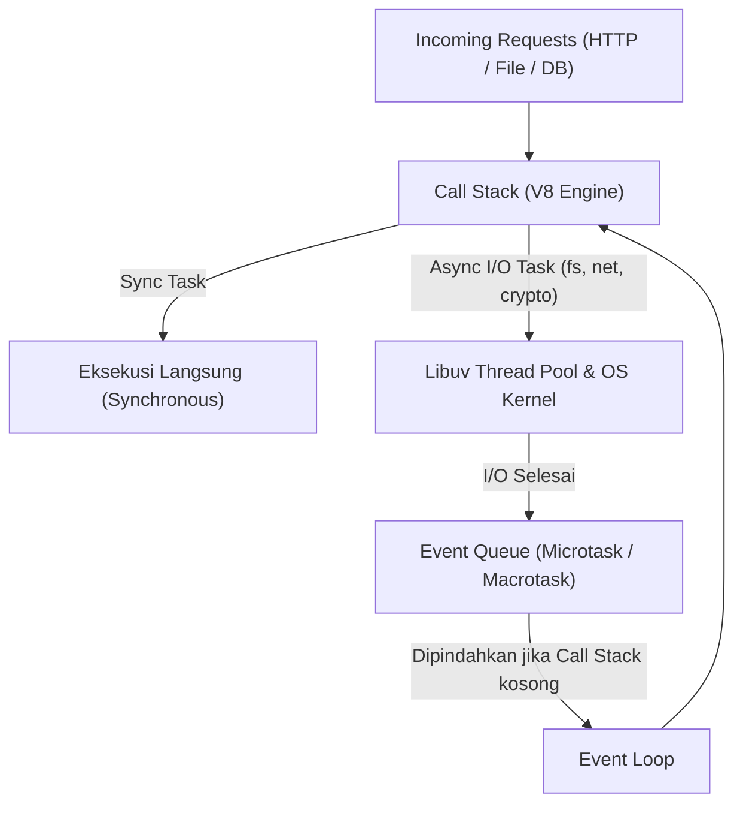

import Callout from '../../components/mdx/Callout.astro';
import MultiLangRunner from '../../components/mdx/MultiLangRunner.astro';

**Node.js** bukanlah bahasa pemrograman baru, melainkan *runtime environment* berbasis mesin **V8 JavaScript Google Chrome** yang memungkinkan kode JavaScript dieksekusi di luar peramban (pada level sistem operasi server).

---

## 1. Arsitektur Node.js: Mengapa Sangat Cepat untuk I/O?

Model tradisional web server (seperti Apache HTTP Server klasik) menggunakan model *Multi-Threaded Blocking*: setiap ada 1 permintaan masuk, sistem operasi akan membuat atau mengalokasikan 1 *thread* khusus. Jika ada 10.000 permintaan sekaligus yang sedang menunggu query database, 10.000 thread tersebut memakan banyak memori RAM (*Context Switching Overhead*).

Node.js menggunakan model **Single-Threaded Non-Blocking I/O** yang ditenagai oleh pustaka **libuv**:



### Komponen Kunci Arsitektur Node.js:
1. **V8 Engine**: Mengompilasi kode JavaScript langsung ke *machine code* (bahasa mesin) yang sangat optimal.
2. **Libuv**: Pustaka C/C++ yang menangani *Asynchronous I/O*, akses jaringan (*sockets*), file system, serta menyediakan *Thread Pool* (default 4 thread) untuk komputasi berat di balik layar.
3. **Event Loop**: Mekanisme yang terus memantau apakah *Call Stack* kosong. Jika kosong, Event Loop akan mengambil callback dari antrean (*Task Queue*) untuk dieksekusi.

---

## 2. Hierarki Antrean Event Loop: Microtasks vs Macrotasks

Prioritas eksekusi kode asynchronous dalam Node.js memiliki urutan pasti:

```text
[Call Stack Selesai] 
  ──> 1. Process.nextTick Queue
  ──> 2. Microtask Queue (Promise .then / await)
  ──> 3. Macrotask Phase 1: Timers (setTimeout, setInterval)
  ──> 4. Macrotask Phase 2: Pending I/O Callbacks
  ──> 5. Macrotask Phase 3: Check Phase (setImmediate)
  ──> 6. Macrotask Phase 4: Close Callbacks (socket.on('close'))
```

<Callout type="warning" title="Aturan Emas Node.js Backend">
  **Jangan pernah memblokir Event Loop!** (*Don't Block the Event Loop*). Karena Node.js menjalankan kode logika pada 1 thread utama, operasi matematika berat (misal: enkripsi berulang, regex kompleks, atau komputasi AI besar di JavaScript murni) akan membekukan seluruh server dan membuat semua pengguna lain menunggu. Untuk komputasi berat, gunakan *Worker Threads* atau delegasikan ke service terpisah.
</Callout>

---

## 3. Penanganan Asynchronous Modern: Promises & Async/Await

Di era modern, kita menghindari *Callback Hell* (kumpulan callback bertingkat) dengan memanfaatkan `async/await` yang bersih dan mudah ditangani kesalahannya (*error handling*).

### Pola Penanganan Error Terbaik:
```javascript
// Hindari mengabaikan error atau try-catch kosong!
async function getUserProfile(userId) {
  try {
    const user = await db.findUserById(userId);
    if (!user) {
      const error = new Error("User tidak ditemukan");
      error.statusCode = 404;
      throw error;
    }
    return user;
  } catch (err) {
    console.error(`[Database Error] Gagal memuat user ${userId}:`, err.message);
    throw err; // Lempar kembali agar ditangkap Global Error Middleware
  }
}
```

---

## 4. Praktik Interaktif: Concurrency & Eksekusi Asynchronous

Eksplorasi bagaimana `Promise.all` dan `Promise.allSettled` dapat mempercepat pengambilan data dari beberapa sumber sekaligus (paralel) dibandingkan menunggu satu per satu (sekuensial):

<MultiLangRunner
  language="javascript"
  title="Eksplorasi Concurrency: Sekuensial vs Paralel dengan Promises"
  initialCode={`// Fungsi simulasi fetch data dari microservices eksternal dengan delay
function fetchMockService(serviceName, delayMs, shouldFail = false) {
  return new Promise((resolve, reject) => {
    setTimeout(() => {
      if (shouldFail) {
        reject(new Error(\`Service [\${serviceName}] mengalami timeout/gagal\`));
      } else {
        resolve({ service: serviceName, latency: \`\${delayMs}ms\`, timestamp: Date.now() });
      }
    }, delayMs);
  });
}

async function runDemo() {
  console.log("=== 1. EKSEKUSI SEKUENSIAL (Lambat: Satu per satu) ===");
  const startSeq = Date.now();
  
  const user = await fetchMockService("Auth Service", 150);
  const payment = await fetchMockService("Payment Gateway", 200);
  const inventory = await fetchMockService("Warehouse DB", 100);
  
  console.log("Hasil Sekuensial:", [user.service, payment.service, inventory.service]);
  console.log(\`Total Waktu Sekuensial: \${Date.now() - startSeq}ms (akumulasi delay)\\n\`);

  console.log("=== 2. EKSEKUSI PARALEL (Cepat: Bersamaan dengan Promise.all) ===");
  const startPar = Date.now();
  
  // Semua request dikirim secara simultan
  const results = await Promise.all([
    fetchMockService("Auth Service", 150),
    fetchMockService("Payment Gateway", 200),
    fetchMockService("Warehouse DB", 100)
  ]);

  console.log("Hasil Paralel:", results.map(r => r.service));
  console.log(\`Total Waktu Paralel: \${Date.now() - startPar}ms (hanya selama durasi terpanjang)\\n\`);

  console.log("=== 3. EKSEKUSI TOLERAN ERROR (Promise.allSettled) ===");
  const settledResults = await Promise.allSettled([
    fetchMockService("Notification Service", 100),
    fetchMockService("Analytics Service", 150, true), // Simulasi Service Down
    fetchMockService("Recommendation Engine", 120)
  ]);

  settledResults.forEach((res, idx) => {
    if (res.status === "fulfilled") {
      console.log(\`✅ Service #\${idx + 1} Sukses:\`, res.value.service);
    } else {
      console.log(\`❌ Service #\${idx + 1} Gagal:\`, res.reason.message);
    }
  });
}

runDemo();`}
/>

<Callout type="tip" title="Kapan Menggunakan Promise.all vs Promise.allSettled?">
  Gunakan `Promise.all` jika seluruh data saling bergantung (misal: validasi pesanan & debit saldo). Gunakan `Promise.allSettled` jika salah satu servis gagal tidak boleh menggagalkan respon utama (misal: data analytics atau pengiriman email selamat datang).
</Callout>
