import Callout from '../../components/mdx/Callout.astro';
import MultiLangRunner from '../../components/mdx/MultiLangRunner.astro';

**Express.js** adalah framework minimalis dan fleksibel yang menjadi standar de facto untuk membangun API di ekosistem Node.js. Pada bab ini, kita akan mempelajari arsitektur kode berlapis (*Clean Layered Architecture*), manajemen pipeline middleware, dan validasi data terstruktur.

---

## 1. Arsitektur Berlapis (Layered Architecture Pattern)

Hindari meletakkan semua kode query database dan validasi langsung di dalam callback route (*Fat Controller* / *Spaghetti Code*). Gunakan pemisahan tanggung jawab (*Separation of Concerns*):

```text
src/
├── app.js                 # Inisialisasi Express, middleware global, & routing root
├── server.js              # Server bootstrap & listen port
├── routes/                # Mendefinisikan endpoint URL & pemetaan HTTP method
│   └── product.routes.js
├── controllers/           # Menerima request, memanggil service, mengembalikan HTTP response
│   └── product.controller.js
├── services/              # Pure Business Logic (kalkulasi harga, validasi transaksi)
│   └── product.service.js
├── repositories/          # Akses langsung ke database (SQL / ORM)
│   └── product.repository.js
├── middlewares/           # Otentikasi, validasi schema, error handler
│   ├── auth.middleware.js
│   └── validate.middleware.js
└── utils/                 # Custom error class, logger, helper
    └── api-error.js
```

---

## 2. Kekuatan Pipeline Middleware Express.js

Middleware adalah fungsi yang memiliki akses ke objek Request (`req`), Response (`res`), dan fungsi berikutnya (`next`).

```mermaid
flowchart LR
    Req["Request Masuk"] --> M1["Logger Middleware (Pino/Morgan)"]
    M1 --> M2["Security Headers (Helmet)"]
    M2 --> M3["CORS Policy Middleware"]
    M3 --> M4["Body Parser (express.json)"]
    M4 --> M5["Auth JWT Guard"]
    M5 --> M6["Schema Validator (Zod)"]
    M6 --> Handler["Controller Handler"]
    Handler --> Res["Response Dikirim"]
    
    Handler -.->|"Jika Throw Error"| ErrMid["Centralized Error Middleware"]
    ErrMid -.->|"Status 4xx / 500 JSON"| Res
```



### 3 Jenis Middleware Wajib dalam Aplikasi Produksi:

```javascript
import express from 'express';
import helmet from 'helmet';
import cors from 'cors';

const app = express();

// 1. Middleware Keamanan Header & CORS
app.use(helmet());
app.use(cors({ origin: 'https://frontend.domainanda.com', credentials: true }));

// 2. Middleware Parsing JSON Body (dengan batasan ukuran payload)
app.use(express.json({ limit: '10kb' }));

// 3. Centralized Error Handling Middleware (Selalu diletakkan di baris paling bawah!)
app.use((err, req, res, next) => {
  const statusCode = err.statusCode || 500;
  const message = err.isOperational ? err.message : 'Internal Server Error';

  console.error(`[ERROR] ${req.method} ${req.originalUrl}:`, err);

  res.status(statusCode).json({
    success: false,
    statusCode,
    message,
    ...(process.env.NODE_ENV === 'development' && { stack: err.stack }),
  });
});
```

---

## 3. Validasi Skema Input Ketat (Schema Validation)

Jangan pernah mempercayai data dari pengguna (*Never trust client input*). Validasi tipe data, format email, panjang karakter, dan batasan angka sebelum menyentuh database:

```javascript
import { z } from 'zod';

// Skema Validasi Payload Produk
export const createProductSchema = z.object({
  body: z.object({
    name: z.string({ required_error: 'Nama produk wajib diisi' }).min(3).max(100),
    price: z.number({ required_error: 'Harga wajib berupa angka' }).positive('Harga harus > 0'),
    category: z.enum(['elektronik', 'pakaian', 'makanan', 'perabot']),
    stock: z.number().int().nonnegative().default(0),
  }),
});
```

---

## 4. Praktik Interaktif: Simulasi Pipeline Middleware & Router

Jalankan sandbox di bawah ini untuk melihat bagaimana middleware bertingkat menyaring request, memvalidasi token, memverifikasi schema, dan menangani error secara terpusat:

<MultiLangRunner
  language="javascript"
  title="Simulasi Pipeline Middleware Express & Controller"
  initialCode={`// Kelas Custom API Error untuk penanganan error terkontrol
class ApiError extends Error {
  constructor(statusCode, message, isOperational = true) {
    super(message);
    this.statusCode = statusCode;
    this.isOperational = isOperational;
  }
}

// Simulasi Mini Express Middleware Pipeline
class MiniExpressApp {
  constructor() {
    this.middlewares = [];
    this.routes = {};
  }

  use(fn) {
    this.middlewares.push(fn);
  }

  get(path, handler) {
    this.routes[\`GET \${path}\`] = handler;
  }

  post(path, handler) {
    this.routes[\`POST \${path}\`] = handler;
  }

  async handleRequest(req) {
    const res = {
      statusCode: 200,
      headers: { "Content-Type": "application/json" },
      body: null,
      status(code) { this.statusCode = code; return this; },
      json(data) { this.body = data; return this; }
    };

    try {
      // Jalankan seluruh rantai middleware
      for (const mw of this.middlewares) {
        let nextCalled = false;
        await mw(req, res, () => { nextCalled = true; });
        if (!nextCalled) return res; // Middleware memutus rantai (misal respon 401)
      }

      // Jalankan Handler Route yang cocok
      const routeKey = \`\${req.method} \${req.path}\`;
      const handler = this.routes[routeKey];
      
      if (!handler) {
        throw new ApiError(404, \`Endpoint \${routeKey} tidak ditemukan\`);
      }

      await handler(req, res);
      return res;
    } catch (err) {
      // Global Centralized Error Handler
      const status = err.statusCode || 500;
      return res.status(status).json({
        success: false,
        statusCode: status,
        error: err.message
      });
    }
  }
}

// Inisialisasi App
const app = new MiniExpressApp();

// 1. Middleware Logger
app.use((req, res, next) => {
  console.log(\`⚡ [LOG] \${req.method} \${req.path} dari \${req.ip || "127.0.0.1"}\`);
  next();
});

// 2. Middleware Otorisasi (Simulasi Guard)
app.use((req, res, next) => {
  if (req.path.startsWith("/admin") && req.headers["x-role"] !== "admin") {
    res.status(403).json({ success: false, error: "Akses Ditolak: Hanya admin yang diizinkan" });
    return;
  }
  next();
});

// Route 1: Publik
app.get("/items", (req, res) => {
  res.json({
    success: true,
    data: ["Item Alpha", "Item Beta", "Item Gamma"]
  });
});

// Route 2: Admin Protected
app.post("/admin/settings", (req, res) => {
  if (!req.body || !req.body.maintenanceMode) {
    throw new ApiError(400, "Field maintenanceMode diperlukan");
  }
  res.status(200).json({ success: true, message: "Pengaturan sistem diperbarui" });
});

// Skenario 1: Akses route publik
async function test() {
  console.log("--- Uji 1: Route Publik ---");
  const r1 = await app.handleRequest({ method: "GET", path: "/items", headers: {} });
  console.log("Output R1:", r1.statusCode, r1.body);

  console.log("\\n--- Uji 2: Route Admin Ditolak (Bukan Admin) ---");
  const r2 = await app.handleRequest({ method: "POST", path: "/admin/settings", headers: { "x-role": "user" }, body: {} });
  console.log("Output R2:", r2.statusCode, r2.body);

  console.log("\\n--- Uji 3: Route Admin Sukses ---");
  const r3 = await app.handleRequest({ 
    method: "POST", 
    path: "/admin/settings", 
    headers: { "x-role": "admin" }, 
    body: { maintenanceMode: true } 
  });
  console.log("Output R3:", r3.statusCode, r3.body);
}

test();`}
/>

<Callout type="note" title="Prinsip Fail-Fast">
  Dengan menerapkan middleware validasi di depan handler, controller Anda tidak perlu lagi dipenuhi pengecekan `if (!req.body.name)` secara berulang. Jika input tidak valid, middleware akan langsung merespon dengan `422 Unprocessable Entity` atau `400 Bad Request` sebelum menyentuh database.
</Callout>
