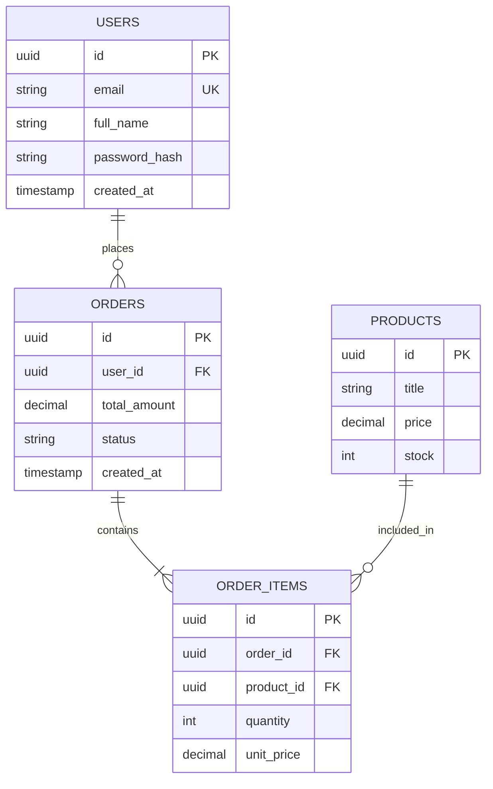

import Callout from '../../components/mdx/Callout.astro';
import MultiLangRunner from '../../components/mdx/MultiLangRunner.astro';

Sebagian besar aplikasi enterprise modern bergantung pada **Relational Database Management Systems (RDBMS)** seperti **PostgreSQL** dan **MySQL** karena kepatuhannya terhadap prinsip **ACID (*Atomicity, Consistency, Isolation, Durability*)**.

---

## 1. Desain Relasi Data & Normalisasi (1NF s/d 3NF)

Desain database yang buruk akan menimbulkan anomali data (duplikasi yang tidak sinkron saat update/delete).



### Tahapan Normalisasi:
1. **1NF (First Normal Form)**: Setiap kolom hanya memiliki nilai atomik tunggal (tidak ada array/daftar teks dipisah koma dalam 1 cell), dan memiliki Primary Key unik.
2. **2NF (Second Normal Form)**: Memenuhi 1NF dan seluruh atribut non-kunci bergantung penuh pada seluruh Primary Key (menghilangkan ketergantungan parsial).
3. **3NF (Third Normal Form)**: Memenuhi 2NF dan tidak ada ketergantungan transitif antar kolom non-kunci (misal: kolom `subtotal` tidak disimpan di tabel jika bisa dihitung dari `quantity * unit_price`).

---

## 2. Mengapa Database Indexing Sangat Krusial?

Tanpa index, pencarian `WHERE email = 'user@example.com'` pada tabel dengan 10.000.000 baris akan memicu **Full Table Scan** (kompleksitas $O(N)$) yang memakan waktu detik/menit dan menghabiskan CPU database.

Dengan menambahkan **B-Tree Index**:
```sql
CREATE INDEX idx_users_email ON users(email);
```
Pencarian menjadi operasi biner seimbang dengan kompleksitas $O(\log N)$, memotong waktu query dari 3.000 ms menjadi **0.8 ms**!

<Callout type="note" title="Trade-Off Indexing">
  Index mempercepat operasi `SELECT`, namun menambah sedikit *overhead* pada operasi `INSERT`, `UPDATE`, dan `DELETE` karena struktur pohon B-Tree harus ditata ulang. Oleh karena itu, pasang index hanya pada kolom yang sering dijadikan filter `WHERE`, `JOIN`, atau `ORDER BY`.
</Callout>

---

## 3. Praktik Interaktif: SQL DDL, DML, Relasi JOIN & Agregasi

Jalankan sandbox SQLite/SQL in-browser di bawah ini untuk membuat tabel relasional, menyisipkan data, melakukan multi-table `JOIN`, dan menghitung rekap analitik penjualan:

<MultiLangRunner
  language="sql"
  title="SQL Playground: Relational Tables, Multi-table JOIN & Aggregation"
  initialCode={`-- 1. Buat Tabel Pengguna
CREATE TABLE users (
  id INTEGER PRIMARY KEY AUTOINCREMENT,
  name VARCHAR(100) NOT NULL,
  email VARCHAR(100) UNIQUE NOT NULL,
  city VARCHAR(50) NOT NULL
);

-- 2. Buat Tabel Produk
CREATE TABLE products (
  id INTEGER PRIMARY KEY AUTOINCREMENT,
  title VARCHAR(100) NOT NULL,
  category VARCHAR(50) NOT NULL,
  price DECIMAL(10, 2) NOT NULL
);

-- 3. Buat Tabel Pesanan (Relasi One-to-Many ke Users)
CREATE TABLE orders (
  id INTEGER PRIMARY KEY AUTOINCREMENT,
  user_id INTEGER NOT NULL,
  order_date DATE NOT NULL,
  status VARCHAR(20) NOT NULL,
  FOREIGN KEY (user_id) REFERENCES users(id)
);

-- 4. Buat Tabel Item Pesanan (Junction Table Many-to-Many)
CREATE TABLE order_items (
  id INTEGER PRIMARY KEY AUTOINCREMENT,
  order_id INTEGER NOT NULL,
  product_id INTEGER NOT NULL,
  quantity INTEGER NOT NULL,
  unit_price DECIMAL(10, 2) NOT NULL,
  FOREIGN KEY (order_id) REFERENCES orders(id),
  FOREIGN KEY (product_id) REFERENCES products(id)
);

-- SEEDING DATA
INSERT INTO users (name, email, city) VALUES 
  ('Budi Santoso', 'budi@mail.com', 'Surabaya'),
  ('Siti Aminah', 'siti@mail.com', 'Jakarta'),
  ('I Putu Wahyu', 'wahyu@mail.com', 'Denpasar');

INSERT INTO products (title, category, price) VALUES 
  ('Laptop Ultra Pro', 'Electronics', 15000000),
  ('Mechanical Keyboard', 'Electronics', 850000),
  ('Meja Kerja Minimalis', 'Furniture', 1200000);

INSERT INTO orders (user_id, order_date, status) VALUES 
  (1, '2026-02-01', 'COMPLETED'),
  (2, '2026-02-02', 'COMPLETED'),
  (1, '2026-02-05', 'PENDING');

INSERT INTO order_items (order_id, product_id, quantity, unit_price) VALUES 
  (1, 1, 1, 15000000),
  (1, 2, 2, 850000),
  (2, 3, 1, 1200000),
  (3, 2, 1, 850000);

-- QUERY ANALITIK LAPORAN PENJUALAN PER PENGGUNA
SELECT 
  u.name AS customer_name,
  u.city,
  COUNT(DISTINCT o.id) AS total_orders,
  SUM(oi.quantity * oi.unit_price) AS total_spent
FROM users u
INNER JOIN orders o ON u.id = o.user_id
INNER JOIN order_items oi ON o.id = oi.order_id
WHERE o.status = 'COMPLETED'
GROUP BY u.id, u.name, u.city
ORDER BY total_spent DESC;`}
/>

<Callout type="tip" title="Analisis Performa Query dengan EXPLAIN ANALYZE">
  Di PostgreSQL produksi, Anda dapat menuliskan `EXPLAIN (ANALYZE, BUFFERS) SELECT ...` untuk melihat apakah planner database menggunakan *Index Scan* (efisien) atau *Seq Scan* (lambat).
</Callout>
