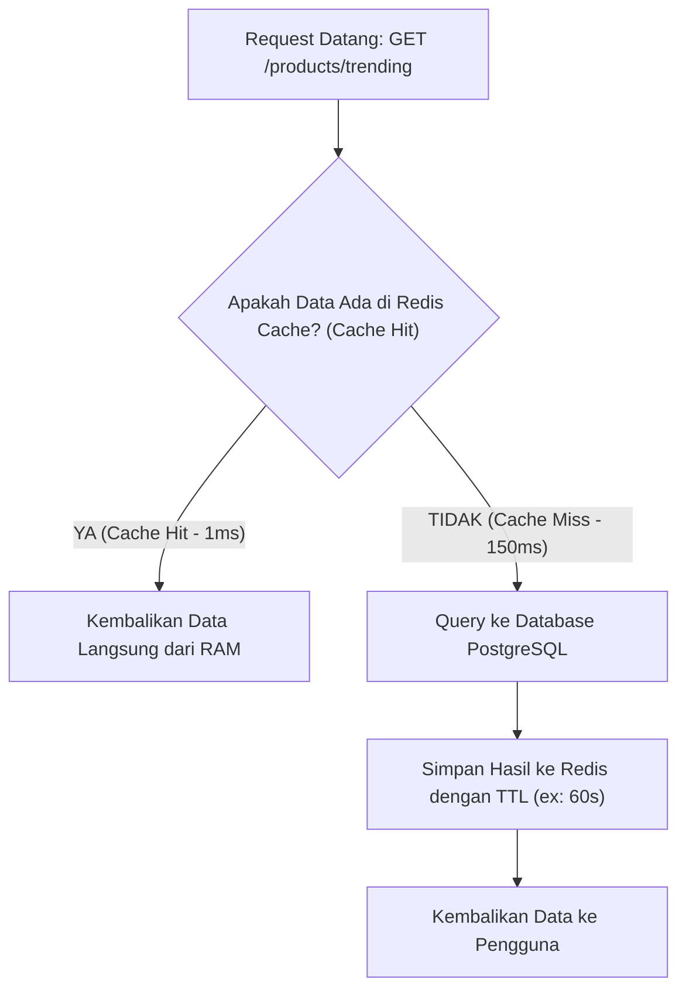

import Callout from '../../components/mdx/Callout.astro';
import MultiLangRunner from '../../components/mdx/MultiLangRunner.astro';

Ketika aplikasi backend Anda melayani jutaan pengguna aktif, mengeksekusi query database yang sama berulang kali akan membebani I/O database dan meningkatkan latensi API. Di sinilah **In-Memory Caching dengan Redis** dan **Asynchronous Background Jobs** berperan penting.

---

## 1. Strategi Caching: Pola Cache-Aside (Lazy Loading)

Pola paling populer di industri adalah **Cache-Aside Pattern**:

### Invalidation Cache: Kapan Menghapus Cache?
1. **Time-To-Live (TTL)**: Data cache otomatis hangus setelah durasi tertentu (misal: 5 menit).
2. **Event-Driven Invalidation**: Ketika produk diperbarui melalui `PUT /products/:id`, backend wajib menghapus key cache terkait di Redis (`redis.del('product:123')`).

---

## 2. Mengapa Asynchronous Message Queue (BullMQ / RabbitMQ) Dibutuhkan?

Bayangkan pengguna menekan tombol *Daftar Akun*. Jika proses registrasi harus mengirim email verifikasi ke SMTP Server (memakan waktu 2-3 detik) dan memproses konversi foto avatar (memakan waktu 5 detik), pengguna akan mengalami *loading* 8 detik sebelum respon HTTP dikirim.

Dengan **Message Queue (Antrean Pesan Terpisah)**:
1. HTTP Server langsung menyimpan data ke DB, memasukkan pesan tugas ke antrean Redis Queue, dan segera merespon `201 Created` dalam **40 milidetik**!
2. **Background Worker** yang berjalan di background akan memproses pengiriman email dan konversi gambar secara asinkron tanpa memblokir pengguna.

---

## 3. Praktik Interaktif: Simulasi Cache-Aside Engine & Latency Comparison

Jalankan sandbox di bawah ini untuk melihat perbandingan latensi antara *Cache Miss* (mengambil dari disk database) dan *Cache Hit* (mengambil instan dari in-memory RAM):

<MultiLangRunner
  language="javascript"
  title="Simulasi Cache-Aside Pattern & Latency Benchmarking"
  initialCode={`// Simulasi In-Memory Redis Store
const redisCache = new Map();

// Simulasi Database Lambat (I/O Disk)
async function fetchFromSlowDatabase(queryKey) {
  console.log(\`  🔍 [DATABASE DISK] Mengeksekusi query SQL berat untuk: \${queryKey}...\`);
  // Simulasi latency database 120ms
  await new Promise(r => setTimeout(r, 120));
  return {
    reportTitle: "Laporan Penjualan Q1 2026",
    totalRevenue: 850000000,
    generatedAt: new Date().toLocaleTimeString()
  };
}

// Service dengan Cache-Aside Pattern
async function getFinancialReport(reportId, ttlSeconds = 2) {
  const cacheKey = \`report:\${reportId}\`;
  
  // 1. Cek Redis Cache
  const cachedData = redisCache.get(cacheKey);
  if (cachedData) {
    if (Date.now() < cachedData.expiresAt) {
      console.log(\`  ⚡ [CACHE HIT] Data ditemukan di RAM Redis!\`);
      return { source: "REDIS_CACHE", data: cachedData.value };
    } else {
      console.log(\`  ⚠️ [CACHE EXPIRED] TTL habis, menghapus key \${cacheKey}\`);
      redisCache.delete(cacheKey);
    }
  }

  // 2. Cache Miss: Ambil dari Database Lambat
  console.log(\`  ❌ [CACHE MISS] Mengambil data dari Database...\`);
  const freshData = await fetchFromSlowDatabase(reportId);

  // 3. Simpan kembali ke Redis dengan TTL
  redisCache.set(cacheKey, {
    value: freshData,
    expiresAt: Date.now() + (ttlSeconds * 1000)
  });

  return { source: "POSTGRESQL_DB", data: freshData };
}

async function benchmark() {
  console.log("=== REQUEST 1: Pengguna A Meminta Laporan (Cache Kosong) ===");
  const t1 = Date.now();
  const res1 = await getFinancialReport("fin_2026_q1");
  console.log(\`Hasil 1 (Source: \${res1.source}) -> Waktu: \${Date.now() - t1}ms\\n\`);

  console.log("=== REQUEST 2: Pengguna B Meminta Laporan yang Sama (Cache Aktif) ===");
  const t2 = Date.now();
  const res2 = await getFinancialReport("fin_2026_q1");
  console.log(\`Hasil 2 (Source: \${res2.source}) -> Waktu: \${Date.now() - t2}ms (Sangat Cepat!)\\n\`);

  console.log("=== REQUEST 3: Simulasi Menunggu TTL Cache Habis (3 Detik)... ===");
  await new Promise(r => setTimeout(r, 2500));

  const t3 = Date.now();
  const res3 = await getFinancialReport("fin_2026_q1");
  console.log(\`Hasil 3 (Source: \${res3.source}) -> Waktu: \${Date.now() - t3}ms\`);
}

benchmark();`}
/>

<Callout type="tip" title="Tips Skalabilitas">
  Gunakan Redis tidak hanya untuk query caching, tapi juga untuk **Rate Limiting** (membatasi maksimum 100 request/menit per alamat IP) untuk melindungi API Anda dari serangan brute-force dan pencurian data (*scraping*).
</Callout>
