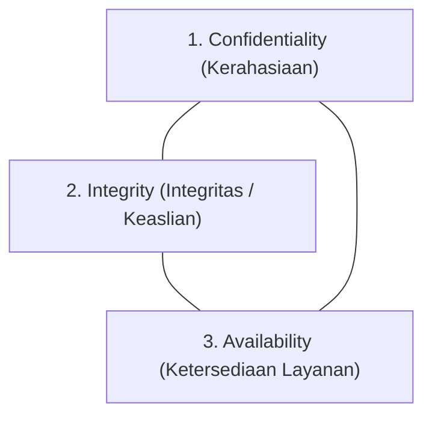

import Callout from '../../components/mdx/Callout.astro';
import MultiLangRunner from '../../components/mdx/MultiLangRunner.astro';

Selamat datang di kursus komprehensif **Cybersecurity & Keamanan Web: Ethical Hacking, OWASP Top 10 & Pengamanan API**! Di era transformasi digital dan komputasi awan, keamanan bukan lagi fitur tambahan di akhir proyek (*afterthought*), melainkan pilar fundamental yang wajib dirancang sejak baris kode pertama ditulis (*Security by Design*).

---

## 1. Segitiga Emas Keamanan: CIA Triad

Setiap kebijakan dan arsitektur keamanan di dunia berakar pada tiga pilar utama **CIA Triad**:



1. **Confidentiality (Kerahasiaan)**: Menjamin bahwa data sensitif (password, nomor KTP, rekam medis, data keuangan) hanya dapat diakses oleh pihak yang berwenang. *Pencegahan: Enkripsi data at-rest & in-transit, Masking, Access Control.*
2. **Integrity (Integritas)**: Menjamin bahwa data tidak dimanipulasi, diubah, atau dirusak oleh pihak yang tidak berhak di tengah jalan. *Pencegahan: Hashing kriptografis, Digital Signature, Database Constraints.*
3. **Availability (Ketersediaan)**: Menjamin bahwa sistem dan data selalu dapat diakses oleh pengguna sah kapan pun dibutuhkan. *Pencegahan: Redundansi server, Proteksi Anti-DDoS, Load Balancing, Disaster Recovery Backup.*

---

## 2. Prinsip Defense in Depth (Pertahanan Berlapis)

Jangan pernah bergantung pada satu lapis pengamanan saja. Jika dinding luar berhasil ditembus hacker, masih ada lapisan pertahanan di dalamnya:

```text
[Internet Publik]
  └── Lapis 1: Cloudflare WAF & Proteksi DDoS
        └── Lapis 2: NGINX Reverse Proxy + SSL/TLS 1.3
              └── Lapis 3: Rate Limiter & Security Headers (CSP/Helmet)
                    └── Lapis 4: Autentikasi JWT & Otorisasi RBAC
                          └── Lapis 5: Input Validation & Sanitization (Zod/DOMPurify)
                                └── Lapis 6: Prepared Statement SQL & DB Encryption
```

---

## 3. Pemodelan Ancaman: Kerangka Kerja STRIDE

Microsoft merumuskan model ancaman **STRIDE** untuk mengidentifikasi potensi bahaya sistem:

| Kategori Ancaman | Arti | Prinsip yang Dilanggar | Contoh Kasus |
| :--- | :--- | :--- | :--- |
| **S - Spoofing** | Menyamar sebagai pengguna/server lain | Kerahasiaan & Keaslian | Pencurian Session ID / IP Spoofing |
| **T - Tampering** | Mengubah data tanpa izin | Integritas | Mengubah parameter harga produk di request HTTP |
| **R - Repudiation** | Menyangkal telah melakukan aksi transaksi | Akuntabilitas | Ketiadaan audit log saat penghapusan database |
| **I - Information Disclosure** | Kebocoran data sensitif ke publik | Kerahasiaan | Stack trace error database bocor ke pengguna |
| **D - Denial of Service** | Melumpuhkan server hingga tidak bisa diakses | Ketersediaan | Membanjiri endpoint login dengan jutaan request |
| **E - Elevation of Privilege** | Pengguna biasa naik kasta menjadi Admin | Otorisasi | Eksploitasi celah IDOR / Role Manipulation |

---

## 4. Praktik Interaktif: Kalkulator Skor Risiko CVSS v3.1

Di industri keamanan siber, tingkat keparahan suatu celah keamanan diukur secara standar menggunakan sistem **Common Vulnerability Scoring System (CVSS v3.1)** dengan rentang skor `0.0` (None) hingga `10.0` (Critical):

<MultiLangRunner
  language="javascript"
  title="Kalkulator Tingkat Keparahan Celah Keamanan CVSS v3.1"
  initialCode={`// Engine Kalkulasi Tingkat Risiko Celah Keamanan (Simplified CVSS v3.1)
function calculateCvssScore({ attackVector, attackComplexity, privilegesRequired, userInteraction, impactConfidentiality, impactIntegrity, impactAvailability }) {
  // Bobot Metrik Eksploitasi
  const avWeights = { NETWORK: 0.85, ADJACENT: 0.62, LOCAL: 0.55, PHYSICAL: 0.20 };
  const acWeights = { LOW: 0.77, HIGH: 0.44 };
  const prWeights = { NONE: 0.85, LOW: 0.62, HIGH: 0.27 };
  const uiWeights = { NONE: 0.85, REQUIRED: 0.62 };

  // Bobot Dampak
  const impactWeights = { NONE: 0.0, LOW: 0.22, HIGH: 0.56 };

  const exploitability = 8.22 * avWeights[attackVector] * acWeights[attackComplexity] * prWeights[privilegesRequired] * uiWeights[userInteraction];
  
  const iss = 1 - ((1 - impactWeights[impactConfidentiality]) * (1 - impactWeights[impactIntegrity]) * (1 - impactWeights[impactAvailability]));
  const impact = 7.52 * iss;

  let baseScore = 0;
  if (impact > 0) {
    baseScore = Math.min(10.0, Math.ceil((exploitability + impact) * 10) / 10);
  }

  let severity = "NONE";
  if (baseScore >= 9.0) severity = "CRITICAL (Segera Perbaiki!)";
  else if (baseScore >= 7.0) severity = "HIGH (Risiko Tinggi)";
  else if (baseScore >= 4.0) severity = "MEDIUM (Risiko Sedang)";
  else if (baseScore > 0.0) severity = "LOW (Risiko Rendah)";

  return { baseScore, severity, exploitability: exploitability.toFixed(2), impact: impact.toFixed(2) };
}

// Skenario 1: Remote SQL Injection tanpa Login (Jaringan Internet Publik)
console.log("=== SKENARIO 1: SQL Injection pada Halaman Login Publik ===");
const sqliRisk = calculateCvssScore({
  attackVector: "NETWORK",
  attackComplexity: "LOW",
  privilegesRequired: "NONE",
  userInteraction: "NONE",
  impactConfidentiality: "HIGH",
  impactIntegrity: "HIGH",
  impactAvailability: "HIGH"
});
console.log(sqliRisk);

// Skenario 2: Stored XSS yang membutuhkan interaksi klik admin
console.log("\\n=== SKENARIO 2: XSS yang Membutuhkan Interaksi Admin ===");
const xssRisk = calculateCvssScore({
  attackVector: "NETWORK",
  attackComplexity: "LOW",
  privilegesRequired: "LOW",
  userInteraction: "REQUIRED",
  impactConfidentiality: "LOW",
  impactIntegrity: "LOW",
  impactAvailability: "NONE"
});
console.log(xssRisk);`}
/>

<Callout type="tip" title="Prinsip Least Privilege">
  Selalu terapkan prinsip **Least Privilege (Hak Akses Minimum)**: setiap pengguna, proses aplikasi, dan kredensial koneksi database hanya boleh diberikan hak akses seminimal mungkin yang diperlukan untuk menjalankan fungsinya.
</Callout>
