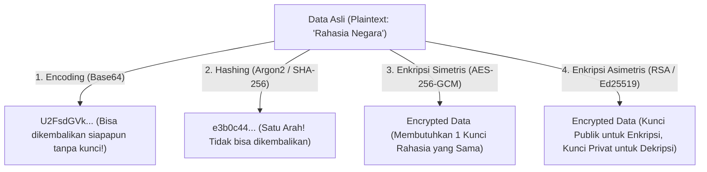

import Callout from '../../components/mdx/Callout.astro';
import MultiLangRunner from '../../components/mdx/MultiLangRunner.astro';

Kriptografi adalah ilmu matematika yang mendasari seluruh perlindungan privasi di internet. Memahami perbedaan antara **Encoding**, **Hashing**, **Enkripsi Simetris**, dan **Enkripsi Asimetris** adalah syarat mutlak bagi setiap praktisi keamanan.

---

## 1. Perbedaan 4 Istilah Kriptografi yang Sering Tertukar

| Metode | Bersifat Reversibel? | Membutuhkan Kunci Rahasia? | Tujuan Utama |
| :--- | :--- | :--- | :--- |
| **Encoding** (Base64, URL) | **Ya** (Mudah) | **Tidak** | Kompatibilitas transmisi data antar protokol |
| **Hashing** (Argon2, SHA-256) | **Tidak** (Satu Arah) | Opsional (Salt) | Integritas data & penyimpanan password |
| **Enkripsi Simetris** (AES-256) | **Ya** | **Ya** (1 Kunci Bersama) | Kecepatan tinggi untuk volume data besar |
| **Enkripsi Asimetris** (RSA, ECC) | **Ya** | **Ya** (Pasangan Public-Private Key) | Pertukaran kunci aman & Tanda Tangan Digital |

---

## 2. Public Key Infrastructure (PKI) & TLS 1.3 Handshake

Bagaimana browser Anda tahu bahwa Anda benar-benar sedang terhubung ke server resmi bank Anda dan bukan ke laptop hacker di WiFi publik yang sama?

Melalui **Public Key Infrastructure (PKI)** dan **Sertifikat Digital X.509**:
1. Server menyajikan sertifikat SSL/TLS yang ditandatangani secara kriptografis oleh lembaga otoritas terpercaya (*Certificate Authority / CA* seperti Let's Encrypt atau DigiCert).
2. Browser memverifikasi tanda tangan CA menggunakan kunci publik root yang sudah tertanam di sistem operasi.
3. Melalui algoritma **Diffie-Hellman Key Exchange**, kedua pihak menyepakati sebuah *Session Key* simetris sementara tanpa pernah mengirimkan kunci tersebut secara telanjang di jaringan (*Forward Secrecy*).

---

## 3. Praktik Interaktif: Simulasi Enkripsi Simetris AES & Hashing

Eksplorasi pembuatan enkripsi data, perbandingan cipher, dan deteksi tampering data di sandbox interaktif:

<MultiLangRunner
  language="javascript"
  title="Implementasi Enkripsi Simetris & Verifikasi Integritas Data"
  initialCode={`// Simulasi Kriptografi Simetris dengan Autentikasi Integritas
class SimpleCryptoEngine {
  constructor(secretKey) {
    this.key = secretKey;
  }

  // Simulasi Hashing SHA-like untuk Integritas (Checksum)
  generateHash(text) {
    let hash = 0;
    for (let i = 0; i < text.length; i++) {
      hash = ((hash << 5) - hash) + text.charCodeAt(i);
      hash |= 0;
    }
    return Math.abs(hash).toString(16).padStart(8, "0");
  }

  // Simulasi Enkripsi AES Simetris (XOR Stream Cipher dengan Kunci)
  encrypt(plaintext) {
    const iv = Math.random().toString(36).substring(2, 8); // Initialization Vector
    let encryptedChars = [];
    
    for (let i = 0; i < plaintext.length; i++) {
      const charCode = plaintext.charCodeAt(i);
      const keyChar = this.key.charCodeAt(i % this.key.length);
      const ivChar = iv.charCodeAt(i % iv.length);
      encryptedChars.push(String.fromCharCode(charCode ^ keyChar ^ ivChar));
    }

    const cipherBase64 = btoa(encryptedChars.join(""));
    const integrityChecksum = this.generateHash(plaintext + this.key);

    return {
      iv,
      ciphertext: cipherBase64,
      checksum: integrityChecksum
    };
  }

  // Simulasi Dekripsi & Verifikasi Integritas
  decrypt(payload) {
    const { iv, ciphertext, checksum } = payload;
    const rawCipher = atob(ciphertext);
    let decryptedChars = [];

    for (let i = 0; i < rawCipher.length; i++) {
      const charCode = rawCipher.charCodeAt(i);
      const keyChar = this.key.charCodeAt(i % this.key.length);
      const ivChar = iv.charCodeAt(i % iv.length);
      decryptedChars.push(String.fromCharCode(charCode ^ keyChar ^ ivChar));
    }

    const decryptedText = decryptedChars.join("");
    const expectedChecksum = this.generateHash(decryptedText + this.key);

    if (expectedChecksum !== checksum) {
      throw new Error("🚨 PERINGATAN INTEGRITAS: Data telah dimanipulasi di perjalanan!");
    }

    return decryptedText;
  }
}

// --- PENGUJIAN SISTEM ENKRIPSI ---
const engine = new SimpleCryptoEngine("KunciSuperRahasia2026!Awd");
const dataRahasia = "Nomor Rekening: 5829-01-998822-53-1 | Saldo: Rp 1.500.000.000";

console.log("1. Data Asli:", dataRahasia);
const paketEnkripsi = engine.encrypt(dataRahasia);
console.log("2. Paket Terenkripsi di Jaringan:", paketEnkripsi);

console.log("\\n3. Proses Dekripsi oleh Pihak Berwenang:");
console.log("Hasil Dekripsi Sukses:", engine.decrypt(paketEnkripsi));

console.log("\\n4. Uji Manipulasi Data oleh Hacker (Tampering Attack):");
try {
  // Hacker mencoba memodifikasi payload ciphertext
  const paketPalsu = { ...paketEnkripsi, ciphertext: btoa("Nomor Rekening Palsu") };
  engine.decrypt(paketPalsu);
} catch (err) {
  console.error("Proteksi Integritas Aktif:", err.message);
}`}
/>

<Callout type="warning" title="Aturan Emas Kriptografi">
  **Jangan pernah membuat algoritma kriptografi sendiri untuk lingkungan produksi!** (*Don't roll your own crypto*). Selalu gunakan pustaka standar yang diaudit secara global seperti `crypto` bawaan Node.js (OpenSSL), Web Crypto API, atau libsodium.
</Callout>
