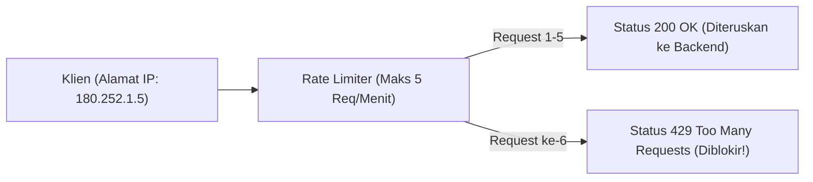

import Callout from '../../components/mdx/Callout.astro';
import MultiLangRunner from '../../components/mdx/MultiLangRunner.astro';

RESTful API adalah urat nadi komunikasi antara aplikasi seluler, Single Page Application (SPA), dan layanan backend. Namun, API publik juga menjadi target empuk serangan *Credential Stuffing*, eksploitasi token JWT, dan *Denial of Service (DoS)*.

---

## 1. Serangan Umum pada JSON Web Token (JWT)

1. **Algorithm Confusion Attack (`alg: none`)**: Hacker memodifikasi header JWT menjadi `{"alg": "none"}` dan menghapus bagian signature. Jika library backend tidak memeriksa algoritma, hacker dapat memalsukan token admin dengan mudah!
2. **Kunci Rahasia Lemah (Weak HMAC Secret)**: Menggunakan secret key pendek seperti `"secret"` atau `"12345"` yang dapat di-brute force dalam hitungan detik menggunakan tool seperti *hashcat* atau *jwt-cracker*.
3. **Pencurian Token & Ketiadaan Revokasi**: JWT bersifat stateless, artinya jika token dicuri, penyerang dapat menggunakannya hingga masa kadaluarsa habis.

```javascript
// SOLUSI PENCEGAHAN SERANGAN JWT:
import jwt from 'jsonwebtoken';

// 1. Kunci Rahasia Wajib Panjang (Minimal 256-bit entropy acak)
const JWT_SECRET = process.env.JWT_SECRET; // Minimal 64 karakter acak

// 2. Kunci Eksplisit Algoritma yang Diizinkan (Tolak 'none')
export function verifyAccessToken(token) {
  return jwt.verify(token, JWT_SECRET, {
    algorithms: ['HS256'], // HANYA izinkan HS256!
    issuer: 'https://api.awdcourse.id',
    audience: 'https://app.awdcourse.id'
  });
}
```

---

## 2. Rate Limiting: Algoritma Sliding Window Token Bucket

Tanpa rate limiter, hacker dapat mengirimkan 5.000 percobaan password per detik ke endpoint `POST /api/v1/auth/login`.



---

## 3. Praktik Interaktif: Implementasi Token Bucket Rate Limiter

Eksplorasi pembuatan engine proteksi rate limiting berbasis IP di sandbox interaktif:

<MultiLangRunner
  language="javascript"
  title="Implementasi Engine Rate Limiter Berbasis IP"
  initialCode={`class TokenBucketRateLimiter {
  constructor(maxTokens = 5, refillRatePerSecond = 1) {
    this.maxTokens = maxTokens;
    this.refillRate = refillRatePerSecond;
    this.buckets = new Map(); // Menyimpan { ip: { tokens, lastRefill } }
  }

  _refill(bucket) {
    const now = Date.now();
    const elapsedTimeSeconds = (now - bucket.lastRefill) / 1000;
    const tokensToAdd = elapsedTimeSeconds * this.refillRate;

    bucket.tokens = Math.min(this.maxTokens, bucket.tokens + tokensToAdd);
    bucket.lastRefill = now;
  }

  isAllowed(clientIp) {
    if (!this.buckets.has(clientIp)) {
      this.buckets.set(clientIp, {
        tokens: this.maxTokens,
        lastRefill: Date.now()
      });
    }

    const bucket = this.buckets.get(clientIp);
    this._refill(bucket);

    if (bucket.tokens >= 1) {
      bucket.tokens -= 1;
      return {
        allowed: true,
        remainingTokens: Math.floor(bucket.tokens),
        statusCode: 200
      };
    } else {
      return {
        allowed: false,
        remainingTokens: 0,
        statusCode: 429,
        errorMessage: "429 Too Many Requests: Batas laju request tercapai. Coba lagi nanti."
      };
    }
  }
}

// --- PENGUJIAN RATE LIMITER ---
const limiter = new TokenBucketRateLimiter(3, 0.5); // Maks 3 token, isi 1 token tiap 2 detik
const ipNormal = "192.168.1.10";
const ipBotHacker = "10.0.0.99";

console.log("=== SIMULASI SPAM DARI BOT HACKER (7 Request Berturut-turut) ===");
for (let i = 1; i <= 6; i++) {
  const check = limiter.isAllowed(ipBotHacker);
  if (check.allowed) {
    console.log(\`✅ Request #\${i}: DITERIMA (Sisa kuota: \${check.remainingTokens})\`);
  } else {
    console.log(\`🛑 Request #\${i}: DIBLOKIR -> \${check.errorMessage}\`);
  }
}`}
/>

<Callout type="tip" title="Rate Limiting di Multi-Server">
  Untuk sistem klaster dengan multi-instance server, simpan counter rate limiting di dalam **Redis** in-memory store agar seluruh instance server berbagi kuota pembatasan IP yang sama.
</Callout>
