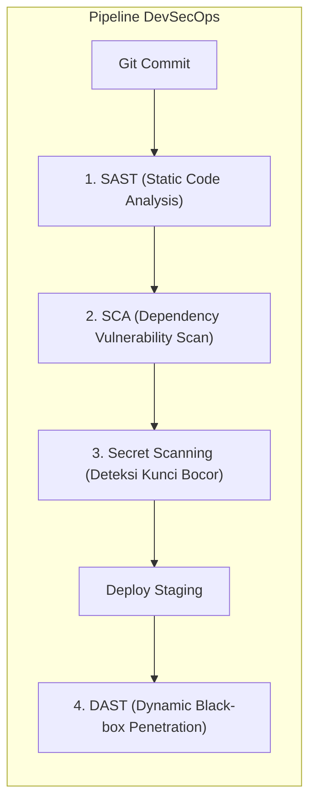

import Callout from '../../components/mdx/Callout.astro';

Dahulu, audit keamanan perangkat lunak baru dilakukan satu minggu sebelum aplikasi dirilis ke produksi. Jika ditemukan celah arsitektur kritis, tim harus merombak ulang kode dari awal (*Late-stage Security Bottleneck*). **DevSecOps** menggeser tanggung jawab keamanan ke tahap paling awal dalam siklus pengembangan (*Shift-Left Security*).

---

## 1. Empat Pilar Pengujian Keamanan Otomatis (AST)



1. **SAST (Static Application Security Testing)**: Memindai kode sumber (*source code*) tanpa menjalankan aplikasi (misal: SonarQube, Semgrep, ESLint Security Plugin).
2. **SCA (Software Composition Analysis)**: Memeriksa apakah library open-source di `package.json` memiliki kerentanan CVE yang sudah diketahui publik (misal: `npm audit`, Snyk, GitHub Dependabot).
3. **Secret Scanning**: Mencegah developer secara tidak sengaja meng-commit API key, private key SSH, atau password database ke repositori Git (misal: GitGuardian, Trufflehog).
4. **DAST (Dynamic Application Security Testing)**: Menguji aplikasi yang sedang berjalan dari luar seperti hacker sungguhan (*Black-box testing*) untuk mendeteksi kerentanan runtime (misal: OWASP ZAP, Burp Suite).

---

## 2. Praktik Manajemen Kunci Rahasia (Secrets Management)

### Aturan Emas Secrets:
- **Jangan Pernah Meng-commit File `.env`**: Selalu sertakan `.env` di `.dockerignore` dan `.gitignore`.
- **Gunakan Secret Manager Terpusat**: Di lingkungan cloud produksi, gunakan **AWS Secrets Manager**, **HashiCorp Vault**, atau **GCP Secret Manager** yang mendukung rotasi kunci otomatis tanpa perlu restart server.
- **Enkripsi Kredensial Backup**: Seluruh file dump database wajib dienkripsi dengan GPG/AES sebelum diunggah ke storage cloud.

---

## 3. Integrasi Security Scan pada GitHub Actions

```yaml
# Cuplikan Integrasi DevSecOps di CI/CD
jobs:
  security_audit:
    runs-on: ubuntu-latest
    steps:
      - uses: actions/checkout@v4

      # 1. Scan Dependency (SCA)
      - name: Run NPM Audit
        run: npm audit --audit-level=high

      # 2. Scan Rahasia Kredensial Bocor
      - name: Scan for leaked secrets
        uses: trufflesecurity/trufflehog@main
        with:
          path: ./
          base: ${{ github.event.repository.default_branch }}

      # 3. Static Code Analysis (SAST) dengan Semgrep
      - name: Run Semgrep SAST
        uses: returntocorp/semgrep-action@v1
        with:
          config: p/owasp-top-ten
```

<Callout type="tip" title="Shift-Left Mindset">
  Semakin cepat celah keamanan ditemukan (pada laptop developer melalui pre-commit hooks), semakin murah dan mudah biaya perbaikannya dibandingkan jika celah tersebut dieksploitasi di server produksi.
</Callout>
