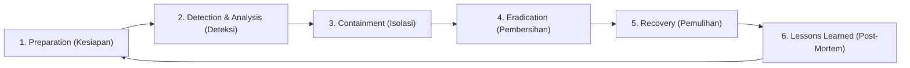

import Callout from '../../components/mdx/Callout.astro';
import MultiLangRunner from '../../components/mdx/MultiLangRunner.astro';

Bagi setiap perusahaan teknologi, pertanyaannya bukan lagi *"apakah sistem kita akan diserang?"*, melainkan *"kapan sistem kita diserang dan seberapa cepat kita dapat merespons serta memulihkannya?"*. Di sinilah protokol **Incident Response (IR)** dan **Log Forensik** memegang peranan krusial.

---

## 1. Enam Tahap Siklus Incident Response (NIST SP 800-61)

1. **Preparation**: Menyiapkan tim tanggap darurat (CSIRT), playbook penanganan insiden, dan backup data teruji.
2. **Detection & Analysis**: Mengidentifikasi indikator kompromi (*Indicator of Compromise / IoC*) melalui monitoring SIEM/Log.
3. **Containment**: Mengisolasi server yang terinfeksi dari jaringan lokal agar malware/hacker tidak menyebar (*Lateral Movement*).
4. **Eradication**: Menghapus malware, menutup celah pintu belakang (*Backdoor*), dan memulihkan patch kode.
5. **Recovery**: Menyalakan kembali sistem secara bertahap dan memverifikasi integritas database.
6. **Lessons Learned**: Menyusun laporan *Post-Mortem* tanpa menyalahkan individu (*Blameless Post-Mortem*) untuk memperkuat sistem di masa depan.

---

## 2. Karakteristik Log Audit yang Siap Forensik (Forensic-Ready)

Log audit yang baik wajib bersifat **Tamper-Evident** (tidak dapat dihapus atau diubah oleh penyerang):
- **Timestamp Bersumber NTP Terstandarisasi** (UTC ISO 8601).
- **Kirim Log ke Server Terpisah (Append-Only Remote Logging)**: Menggunakan Syslog / Grafana Loki / CloudWatch, sehingga jika server utama diretas, histori log tidak bisa dihapus hacker.
- **Anonimisasi PII**: Jangan mencatat password atau data kartu kredit di log (*Masking*).

---

## 3. Praktik Interaktif: Engine Deteksi Anomali Brute Force Login

Jalankan sandbox di bawah ini untuk melihat bagaimana sistem SIEM/Analitik mendeteksi pola serangan *Credential Stuffing* secara otomatis:

<MultiLangRunner
  language="javascript"
  title="Sistem Deteksi Anomali Login & Pemicu Blokir Otomatis"
  initialCode={`// Security Information & Event Management (SIEM) Mini Engine
class SecurityAnomalyDetector {
  constructor(failureThreshold = 3, windowSeconds = 10) {
    this.failureThreshold = failureThreshold;
    this.windowMs = windowSeconds * 1000;
    this.loginAttempts = []; // Log riwayat login
    this.blockedIps = new Set();
  }

  logEvent({ ip, email, success, userAgent }) {
    const timestamp = Date.now();
    this.loginAttempts.push({ ip, email, success, userAgent, timestamp });

    // Bersihkan event di luar jendela waktu
    this.loginAttempts = this.loginAttempts.filter(e => timestamp - e.timestamp <= this.windowMs);

    if (!success) {
      this._analyzeThreat(ip, email);
    }
  }

  _analyzeThreat(ip, targetEmail) {
    // Hitung kegagalan dari IP yang sama dalam jendela waktu
    const failedFromIp = this.loginAttempts.filter(e => e.ip === ip && !e.success).length;

    if (failedFromIp >= this.failureThreshold) {
      this.blockedIps.add(ip);
      console.warn(\`🚨 [SECURITY ALERT] Terdeteksi percobaan Brute-Force dari IP: \${ip}! (\${failedFromIp}x gagal). IP otomatis DIBLOKIR!\`);
    }
  }

  isIpBlocked(ip) {
    return this.blockedIps.has(ip);
  }
}

// --- SIMULASI SERANGAN ---
const siem = new SecurityAnomalyDetector(3, 5); // Blokir jika 3x gagal dalam 5 detik
const hackerIp = "185.220.101.5";

console.log("=== SIMULASI 1: Pengguna Sah Login Normal ===");
siem.logEvent({ ip: "192.168.1.50", email: "user@corp.id", success: true, userAgent: "Chrome/122" });
console.log("Status IP Normal Diblokir? ->", siem.isIpBlocked("192.168.1.50"));

console.log("\\n=== SIMULASI 2: Hacker Menjalankan Script Kamus Password ===");
siem.logEvent({ ip: hackerIp, email: "admin@corp.id", success: false, userAgent: "Python-urllib/3.9" });
siem.logEvent({ ip: hackerIp, email: "admin@corp.id", success: false, userAgent: "Python-urllib/3.9" });
siem.logEvent({ ip: hackerIp, email: "admin@corp.id", success: false, userAgent: "Python-urllib/3.9" });

console.log("Status IP Hacker Diblokir? ->", siem.isIpBlocked(hackerIp));`}
/>

<Callout type="tip" title="Multi-Factor Authentication (MFA)">
  Mengaktifkan **Multi-Factor Authentication (TOTP / Google Authenticator / FIDO2 WebAuthn)** adalah pertahanan paling ampuh yang menetralkan lebih dari 99% serangan pembobolan password massal.
</Callout>
