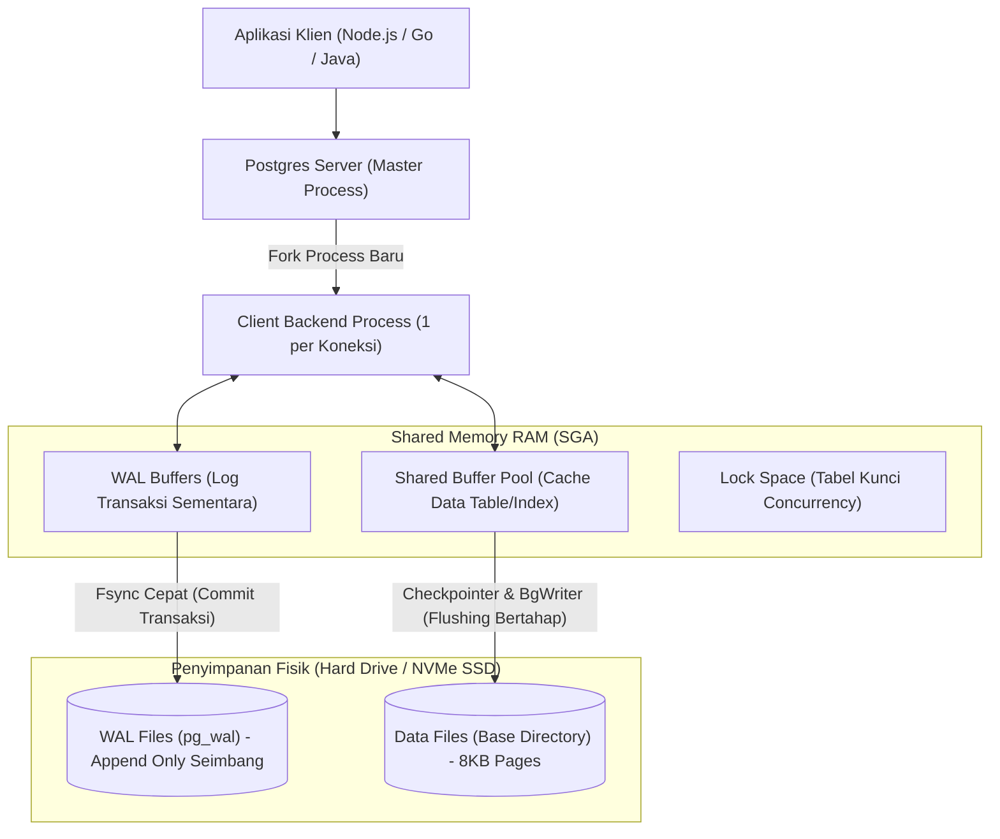

import Callout from '../../components/mdx/Callout.astro';
import MultiLangRunner from '../../components/mdx/MultiLangRunner.astro';

Selamat datang di kursus tingkat lanjut **Database Engineering & SQL Performance Tuning: PostgreSQL, Redis & Optimasi Query**! Banyak pengembang memperlakukan basis data sebagai "kotak hitam" ajaib tempat menyimpan data. Memahami arsitektur internal PostgreSQL pada level memori dan disk adalah kunci utama untuk men-tuning database hingga mampu menangani jutaan transaksi per detik dengan latensi sub-milidetik.

---

## 1. Arsitektur Memori & Proses PostgreSQL

PostgreSQL menggunakan model **Process-Based Architecture** (bukan multi-threaded murni):



---

## 2. Mengapa Write-Ahead Logging (WAL) Sangat Cepat?

Ketika Anda menjalankan perintah `INSERT` atau `UPDATE`, PostgreSQL **tidak langsung menulis data ke berkas tabel utama di disk**, karena penulisan acak (*Random I/O*) ke ribuan blok tabel sangat lambat.

1. Perubahan data pertama kali dicatat ke **Write-Ahead Log (WAL)** secara sekuensial (*Sequential Append I/O*) yang sangat cepat.
2. Data di memori RAM (**Shared Buffers**) ditandai sebagai *Dirty Page*.
3. Transaksi dinyatakan sukses (**Commit**) seketika setelah catatan WAL tersimpan aman di disk (`fsync`).
4. Proses background (**Checkpointer**) nantinya akan menyinkronkan *Dirty Pages* dari RAM ke berkas tabel di disk secara berkala di latar belakang.

---

## 3. Anatomi Blok Halaman Disk (8KB Page) & Multi-Version Concurrency Control (MVCC)

PostgreSQL menyimpan data tabel dalam unit blok fisik berukuran **8 Kilobytes (8.192 bytes)**:

```text
┌───────────────────────────────────────────────────────────┐
│ Page Header (24 bytes): Metadata, LSN, Free Space Pointers│
├───────────────────────────────────────────────────────────┤
│ Item Pointer Array (Linp): Array offset penunjuk baris    │
├───────────────────────────────────────────────────────────┤
│                     FREE SPACE (Ruang Kosong)             │
├───────────────────────────────────────────────────────────┤
│ Tuple 2: Data Baris (xmin: 105, xmax: 0, Data...)         │
│ Tuple 1: Data Baris (xmin: 100, xmax: 105, Data...) [Dead]│
└───────────────────────────────────────────────────────────┘
```

### Bagaimana `UPDATE` Bekerja di PostgreSQL?
Di PostgreSQL, operasi `UPDATE` **tidak pernah menimpa baris data lama di tempat (*In-Place*)**!
- PostgreSQL menandai baris lama sebagai *Dead Tuple* (`xmax = CurrentTxID`).
- PostgreSQL membuat salinan baris baru (*New Tuple*) di ruang kosong halaman.
- Inilah mengapa proses **`VACUUM` (Autovacuum)** wajib berjalan secara rutin untuk membersihkan *Dead Tuples* dan merebut kembali ruang disk kosong.

---

## 4. Praktik Interaktif: DDL, Relasi & Inspeksi Skema Relasional

Jalankan sandbox SQL di bawah ini untuk melihat pembuatan skema relasional terstruktur dengan constraint integritas:

<MultiLangRunner
  language="sql"
  title="SQL Playground: Pembuatan Skema Relasional & Constraint Integritas"
  initialCode={`-- 1. Buat Tabel Master Departemen
CREATE TABLE departments (
  id INTEGER PRIMARY KEY AUTOINCREMENT,
  dept_code VARCHAR(10) UNIQUE NOT NULL,
  dept_name VARCHAR(100) NOT NULL,
  budget DECIMAL(15, 2) CHECK (budget >= 0)
);

-- 2. Buat Tabel Pegawai dengan Foreign Key & Validasi CHECK
CREATE TABLE employees (
  id INTEGER PRIMARY KEY AUTOINCREMENT,
  emp_id VARCHAR(20) UNIQUE NOT NULL,
  full_name VARCHAR(100) NOT NULL,
  email VARCHAR(100) UNIQUE NOT NULL,
  salary DECIMAL(12, 2) NOT NULL CHECK (salary >= 3000000),
  department_id INTEGER NOT NULL,
  is_active BOOLEAN DEFAULT 1,
  created_at TIMESTAMP DEFAULT CURRENT_TIMESTAMP,
  FOREIGN KEY (department_id) REFERENCES departments(id) ON DELETE RESTRICT
);

-- 3. SEEDING DATA
INSERT INTO departments (dept_code, dept_name, budget) VALUES 
  ('ENG', 'Software Engineering & IT', 5000000000),
  ('STAT', 'Pengolahan & Analisis Statistik BPS', 3500000000),
  ('FIN', 'Keuangan & Akuntansi', 2000000000);

INSERT INTO employees (emp_id, full_name, email, salary, department_id) VALUES 
  ('EMP-001', 'I Putu Agus Wahyu Dupayana', 'wahyu@bps.go.id', 12500000, 1),
  ('EMP-002', 'Budi Santoso', 'budi@corp.id', 8500000, 1),
  ('EMP-003', 'Siti Aminah', 'siti@bps.go.id', 9200000, 2),
  ('EMP-004', 'Dewi Lestari', 'dewi@corp.id', 7800000, 3);

-- 4. QUERY AGREGASI REKAP GAJI DAN ANGGARAN PER DEPARTEMEN
SELECT 
  d.dept_code,
  d.dept_name,
  d.budget AS total_budget,
  COUNT(e.id) AS total_staff,
  SUM(e.salary) AS total_payroll,
  ROUND(AVG(e.salary), 2) AS average_salary,
  (d.budget - SUM(e.salary)) AS remaining_budget
FROM departments d
LEFT JOIN employees e ON d.id = e.department_id AND e.is_active = 1
GROUP BY d.id, d.dept_code, d.dept_name, d.budget
ORDER BY total_payroll DESC;`}
/>

<Callout type="tip" title="Tuning Shared Buffers">
  Secara default pada server Linux, alokasikan sekitar **25% dari total memori RAM server** untuk setting `shared_buffers` di berkas `postgresql.conf` (misal: 4GB shared buffers pada server RAM 16GB).
</Callout>
