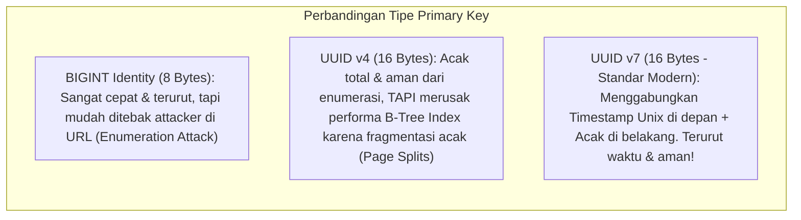

import Callout from '../../components/mdx/Callout.astro';
import MultiLangRunner from '../../components/mdx/MultiLangRunner.astro';

Pondasi performa sebuah basis data ditentukan pada saat skema dibuat. Kesalahan memilih tipe data (misal menggunakan string `VARCHAR(255)` untuk menyimpan tanggal atau boolean) akan memboroskan memori RAM, memperlambat pemindaian index, dan melipatgandakan ukuran disk.

---

## 1. Debat Primary Key: Auto-Increment BIGINT vs UUID v4 vs UUID v7



| Tipe Primary Key | Ukuran Memori | Aman dari Tebakan ID? | Bersahabat dengan B-Tree Index? | Rekomendasi Penggunaan |
| :--- | :--- | :--- | :--- | :--- |
| **BIGINT (Identity)** | 8 Bytes | Tidak (1, 2, 3...) | **Sangat Baik** | Tabel internal referensi / log |
| **UUID v4 (Random)** | 16 Bytes | **Ya** | Buruk (Memicu *Random I/O Disk*) | Kurang disarankan untuk tabel utama skala besar |
| **UUID v7 (Time-Ordered)**| 16 Bytes | **Ya** | **Sangat Baik** (Data baru selalu masuk ke akhir leaf B-Tree) | **Standar Emas Modern untuk Public API** |

---

## 2. Kapan Menggunakan Dokumen `JSONB` vs Tabel Relasional?

PostgreSQL menyediakan tipe data **JSONB (Binary JSON)** yang menyimpan data semi-terstruktur dalam format biner yang dapat diindeks.

### Aturan Memilih Format:
1. **Gunakan Tabel Relasional Normal**:
   - Kolom yang sering dijadikan filter `WHERE`, `JOIN`, atau agregasi keuangan.
   - Data yang memiliki skema kaku dan membutuhkan integritas referensial (Foreign Key).
2. **Gunakan Dokumen `JSONB`**:
   - Atribut produk dinamis yang bervariasi (misal: spesifikasi teknis laptop berbeda dengan ukuran kaos).
   - Log audit audit trail, metadata webhook pihak ketiga, atau preferensi pengguna yang fleksibel.

---

## 3. Partial Unique Constraints & Soft Delete Anti-Pattern

Jika Anda menerapkan pola *Soft Delete* (`is_deleted = true`), constraint unik standar `UNIQUE(email)` akan rusak karena pengguna yang mendaftar ulang dengan email lama akan terblokir oleh baris yang sudah dihapus.

### Solusi: Partial Index / Partial Unique Constraint
```sql
-- Hanya tegakkan keunikan email pada akun yang AKTIF!
CREATE UNIQUE INDEX uq_users_active_email ON users(email) WHERE is_deleted = false;
```

---

## 4. Praktik Interaktif: Implementasi Skema E-Commerce Modern

Jalankan sandbox SQL di bawah ini untuk melihat implementasi skema modern dengan partial index dan kolom JSONB:

<MultiLangRunner
  language="sql"
  title="SQL Playground: JSONB Attributes & Partial Constraints"
  initialCode={`-- 1. Buat Tabel Pengguna dengan Soft-Delete Friendly Unique Index
CREATE TABLE accounts (
  id VARCHAR(36) PRIMARY KEY,
  email VARCHAR(100) NOT NULL,
  full_name VARCHAR(100) NOT NULL,
  is_deleted BOOLEAN DEFAULT 0,
  created_at TIMESTAMP DEFAULT CURRENT_TIMESTAMP
);

-- Buat Partial Unique Index (Email unik hanya bagi akun aktif)
CREATE UNIQUE INDEX idx_unique_active_email ON accounts(email) WHERE is_deleted = 0;

-- 2. Buat Tabel Produk dengan Atribut Fleksibel JSON
CREATE TABLE catalog_products (
  id VARCHAR(36) PRIMARY KEY,
  title VARCHAR(150) NOT NULL,
  price DECIMAL(12, 2) NOT NULL,
  specs_json TEXT NOT NULL -- Menyimpan JSON spesifikasi
);

-- SEEDING DATA
INSERT INTO accounts (id, email, full_name, is_deleted) VALUES 
  ('usr_01', 'wahyu@bps.go.id', 'I Putu Agus Wahyu Dupayana', 0),
  ('usr_02', 'budi@mail.com', 'Budi Santoso (Akun Lama)', 1), -- Akun Dihapus
  ('usr_03', 'budi@mail.com', 'Budi Santoso (Akun Baru)', 0);  -- Budi daftar lagi (Berhasil!)

INSERT INTO catalog_products (id, title, price, specs_json) VALUES 
  ('prod_101', 'MacBook Pro M3 Max', 38000000, '{"ram_gb": 36, "storage_gb": 1000, "screen_inch": 16}'),
  ('prod_102', 'Kaos Polos Katun Combed', 75000, '{"size": "XL", "color": "Navy", "material": "Cotton 30s"}');

-- QUERY SEMUA AKUN AKTIF
SELECT id, email, full_name FROM accounts WHERE is_deleted = 0;

-- QUERY PRODUK BERDASARKAN FILTER
SELECT id, title, price, specs_json FROM catalog_products WHERE price >= 100000;`}
/>

<Callout type="tip" title="Constraint Integrity">
  Gunakan `CHECK (price >= 0)` dan `CHECK (status IN ('PENDING', 'PAID', 'SHIPPED', 'CANCELLED'))` pada level database. Validasi level database menjamin integritas data tetap terjaga 100% meskipun ada script admin atau cron job yang mengeksekusi query di luar aplikasi backend utama.
</Callout>
