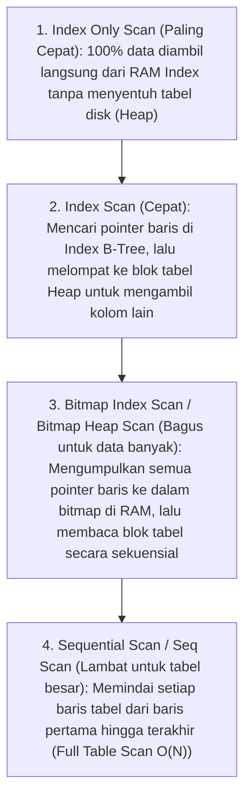

import Callout from '../../components/mdx/Callout.astro';

Satu-satunya cara pasti untuk mengetahui bagaimana engine PostgreSQL mengeksekusi perintah SQL Anda adalah dengan membaca **Query Execution Plan** menggunakan perintah `EXPLAIN`.

---

## 1. Perintah `EXPLAIN` vs `EXPLAIN (ANALYZE, BUFFERS)`

- **`EXPLAIN SELECT ...`**: Hanya menampilkan estimasi rencana planner (*Planner Estimation*) berdasarkan data statistik tabel **tanpa benar-benar menjalankan query**.
- **`EXPLAIN (ANALYZE, BUFFERS) SELECT ...`**: **Benar-benar mengeksekusi query di database**, mengukur waktu nyata dalam milidetik, menghitung jumlah baris aktual, serta menghitung berapa banyak blok halaman memori RAM (*Shared Hit*) dan disk (*Read*) yang dibaca.

```text
QUERY PLAN CONTOH:
Index Scan using idx_users_email on users  (cost=0.42..8.44 rows=1 width=72) (actual time=0.035..0.038 rows=1 loops=1)
  Index Cond: ((email)::text = 'wahyu@bps.go.id'::text)
  Buffers: shared hit=3
Planning Time: 0.082 ms
Execution Time: 0.059 ms
```

---

## 2. Membedah Jenis Scan Data: Dari Paling Cepat ke Paling Lambat



---

## 3. Tiga Algoritma Relasi JOIN

Ketika menggabungkan dua tabel (`INNER JOIN`), PostgreSQL memilih satu dari tiga algoritma:

1. **Nested Loop Join**: Untuk setiap baris di Tabel A, sistem mencari baris yang cocok di Tabel B menggunakan Index. Sangat cepat jika salah satu tabel berukuran kecil.
2. **Hash Join**: PostgreSQL membuat Hash Table in-memory dari tabel yang lebih kecil di RAM, lalu memindai tabel kedua dalam satu lewatan `O(N)`. Algoritma default untuk join tabel besar tanpa indeks.
3. **Merge Join**: Kedua tabel diurutkan terlebih dahulu berdasarkan kunci join, lalu digabungkan secara linier seperti algoritma *Two Pointers*. Sangat efisien jika kedua tabel sudah terurut secara alami oleh Index.

---

## 4. Cara Menghitung I/O Bottlenecks melalui Buffers

Perhatikan metrik `Buffers` pada output `EXPLAIN (ANALYZE, BUFFERS)`:
- `Buffers: shared hit=120`: 120 blok halaman (sekitar 960 KB) berhasil ditemukan langsung di memori RAM (**Cache Hit**).
- `Buffers: shared read=450`: 450 blok halaman **tidak ada di RAM** dan harus dibaca dari disk fisik (**Cache Miss / Disk I/O Bottleneck**).

<Callout type="tip" title="Statistik Database Kedaluwarsa (ANALYZE)">
  Jika PostgreSQL memilih *Seq Scan* padahal Anda sudah membuat Index, kemungkinan statistik distribusi data database sudah usang. Jalankan perintah `ANALYZE nama_tabel;` agar planner memperbarui katalog statistik baris terkini.
</Callout>
