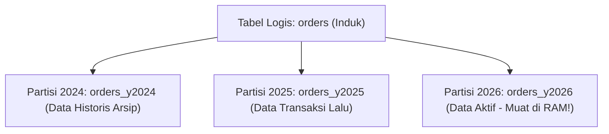

import Callout from '../../components/mdx/Callout.astro';

Ketika tabel transaksi Anda telah menampung ratusan juta baris data (puluhan Gigabytes hingga Terabytes), ukuran file indeks B-Tree akan melampaui kapasitas RAM server, menyebabkan operasi pencarian memicu pembacaan disk yang lambat (*Disk Thrashing*). Di sinilah teknik **Declarative Table Partitioning** dan **Connection Pooling** menjadi solusi mutlak.

---

## 1. Declarative Table Partitioning (Partisi Tabel)

Partisi tabel membagi satu tabel logis besar menjadi beberapa tabel fisik yang lebih kecil di belakang layar:



### Keuntungan Partisi Tabel:
1. **Partition Pruning**: Jika query Anda meminta `WHERE transaction_date >= '2026-01-01'`, PostgreSQL secara cerdas **hanya memindai partisi tahun 2026** dan mengabaikan seluruh partisi tahun-tahun sebelumnya!
2. **Penghapusan Data Usang Instan (`DROP TABLE`)**: Alih-alih menjalankan `DELETE FROM orders WHERE date < '2020-01-01'` yang memakan waktu berjam-jam dan menghasilkan jutaan dead tuples, Anda cukup menjalankan `DROP TABLE orders_y2019;` dalam **2 milidetik**!

```sql
-- Contoh Sintaks Range Partitioning di PostgreSQL
CREATE TABLE audit_logs (
  id BIGINT GENERATED ALWAYS AS IDENTITY,
  user_id VARCHAR(50),
  action VARCHAR(100),
  created_at TIMESTAMP NOT NULL
) PARTITION BY RANGE (created_at);

-- Buat Sub-Tabel Partisi per Bulan
CREATE TABLE audit_logs_2026_01 PARTITION OF audit_logs
  FOR VALUES FROM ('2026-01-01') TO ('2026-02-01');

CREATE TABLE audit_logs_2026_02 PARTITION OF audit_logs
  FOR VALUES FROM ('2026-02-01') TO ('2026-03-01');
```

---

## 2. Mengapa Connection Pooler (PgBouncer) Sangat Dibutuhkan?

Karena arsitektur PostgreSQL membuat 1 proses sistem operasi baru per koneksi klien, setiap koneksi memakan sekitar **5 MB hingga 10 MB RAM**. Jika Anda memiliki 1.000 koneksi bersamaan dari aplikasi serverless, server database akan kehabisan memori (*Connection Exhaustion Crash*).

```text
[1.000 Klien Serverless / Node.js]
             │
             ▼ (1.000 Koneksi Ringan)
┌──────────────────────────────────────┐
│        PgBouncer Connection Pooler   │ ──> Menggunakan Mode: Transaction Pooling
└──────────────────────────────────────┘
             │
             ▼ (Hanya 30-50 Koneksi Nyata ke Server Database!)
[PostgreSQL Database Server (Sehat & Cepat!)]
```

### Mode Pooling PgBouncer:
- **Session Pooling**: 1 koneksi klien memegang 1 koneksi database sampai klien disconnect.
- **Transaction Pooling (Paling Direkomendasikan)**: 1 koneksi database hanya dipinjamkan ke klien selama 1 transaksi SQL berjalan, lalu segera dikembalikan ke pool untuk digunakan request lain!

<Callout type="tip" title="Read Replicas & CQRS Pattern">
  Pisahkan jalur koneksi aplikasi Anda: seluruh operasi penulisan (`INSERT`, `UPDATE`, `DELETE`) diarahkan ke **Primary / Master Database Node**, sedangkan seluruh query pembacaan dashboard/laporan analitik (`SELECT`) diarahkan ke **Read Replicas**.
</Callout>
