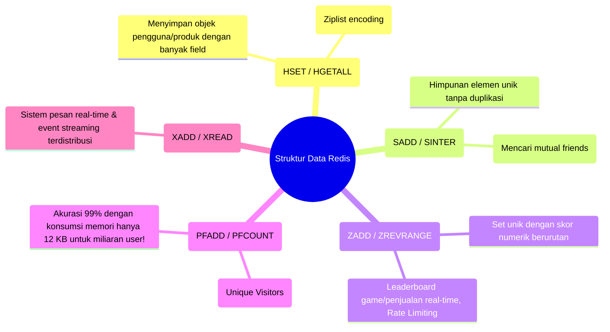

import Callout from '../../components/mdx/Callout.astro';
import MultiLangRunner from '../../components/mdx/MultiLangRunner.astro';

**Redis (Remote Dictionary Server)** adalah basis data *In-Memory* berkecepatan ultra-tinggi yang mendukung latensi baca-tulis sub-milidetik. Banyak developer hanya menggunakan Redis sebagai penyimpanan string *Key-Value* sederhana (`GET` / `SET`). Di modul ini, kita akan membongkar seluruh kekuatan struktur data tingkat lanjut Redis.

---

## 1. Menyelami Ragam Struktur Data Asli Redis



---

## 2. Pola Caching & Strategi Eviction Policy

Ketika memori RAM Redis Anda penuh (misal batas `maxmemory 4gb` tercapai), Redis akan menghapus data berdasarkan kebijakan **Memory Eviction Policy**:

- **`allkeys-lru` (Least Recently Used)**: Menghapus key yang paling lama tidak pernah diakses pengguna. (*Paling direkomendasikan untuk caching umum*).
- **`volatile-ttl`**: Menghapus key yang memiliki waktu kedaluwarsa (TTL) tersisa paling sedikit.
- **`noeviction`**: Menolak penulisan baru dan melempar error saat RAM penuh (cocok jika Redis digunakan sebagai basis data utama).

---

## 3. Distributed Locking dengan Redlock

Untuk mencegah dua server backend memproses transaksi yang sama secara bersamaan (misal checkout promo flash sale), gunakan **Distributed Lock**:

```javascript
// Mengunci resource selama 5 detik
const lock = await redis.set('lock:product:99', 'worker_node_1', 'NX', 'PX', 5000);

if (!lock) {
  throw new Error("Resource sedang diproses oleh transaksi lain. Coba lagi.");
}

try {
  // Eksekusi transaksi kritis
} finally {
  // Selalu lepaskan lock setelah selesai
  await redis.eval(unlockScript, ['lock:product:99'], ['worker_node_1']);
}
```

---

## 4. Praktik Interaktif: Simulasi Real-Time Leaderboard dengan Sorted Set (ZSET)

Eksplorasi pembuatan engine papan peringkat skor penjualan real-time di sandbox interaktif:

<MultiLangRunner
  language="javascript"
  title="Implementasi Engine Leaderboard Real-Time (Redis Sorted Set Pattern)"
  initialCode={`// Simulasi Struktur Data Redis Sorted Set (ZSET)
class RedisSortedSet {
  constructor() {
    this.members = new Map(); // Menyimpan { member: score }
  }

  // ZADD key score member
  zadd(member, score) {
    this.members.set(member, score);
  }

  // ZINCRBY key increment member
  zincrby(member, increment) {
    const current = this.members.get(member) || 0;
    const newScore = current + increment;
    this.members.set(member, newScore);
    return newScore;
  }

  // ZREVRANGE key start stop WITHSCORES (Urut dari Skor Tertinggi)
  zrevrange(start = 0, stop = -1) {
    const sorted = Array.from(this.members.entries())
      .sort((a, b) => b[1] - a[1]); // Descending sort

    const limit = stop === -1 ? sorted.length : stop + 1;
    return sorted.slice(start, limit).map(([member, score], idx) => ({
      rank: start + idx + 1,
      member,
      score
    }));
  }

  // ZRANK / ZREVRANK (Mencari Peringkat Spesifik 1 Member)
  zrevrank(member) {
    const sorted = Array.from(this.members.entries()).sort((a, b) => b[1] - a[1]);
    const index = sorted.findIndex(([m]) => m === member);
    return index !== -1 ? index + 1 : null;
  }
}

// --- PENGUJIAN LEADERBOARD REAL-TIME ---
const salesLeaderboard = new RedisSortedSet();

salesLeaderboard.zadd("Wahyu Dupayana", 150000000);
salesLeaderboard.zadd("Budi Santoso", 85000000);
salesLeaderboard.zadd("Siti Aminah", 120000000);
salesLeaderboard.zadd("Dewi Lestari", 95000000);

console.log("=== 1. PAPAN PERINGKAT TOP 3 SALES (AWAL) ===");
console.log(salesLeaderboard.zrevrange(0, 2));

console.log("\\n=== 2. EVENT PENJUALAN: Budi Berhasil Closing Transaksi +Rp 70.000.000 ===");
salesLeaderboard.zincrby("Budi Santoso", 70000000);

console.log("=== 3. PAPAN PERINGKAT TOP SALES TERBARU ===");
console.log(salesLeaderboard.zrevrange(0, 3));
console.log(\`Posisi Peringkat Budi Sekarang: Ranking #\${salesLeaderboard.zrevrank("Budi Santoso")}\`);`}
/>

<Callout type="tip" title="Redis Pipeline & Multi-Exec">
  Untuk mengirim 100 perintah ke Redis dalam 1 putaran jaringan (*Single Network Round-trip*), gunakan **Redis Pipeline (`pipeline.exec()`)** untuk memangkas latensi jaringan TCP dari 200ms menjadi hanya 2ms!
</Callout>
