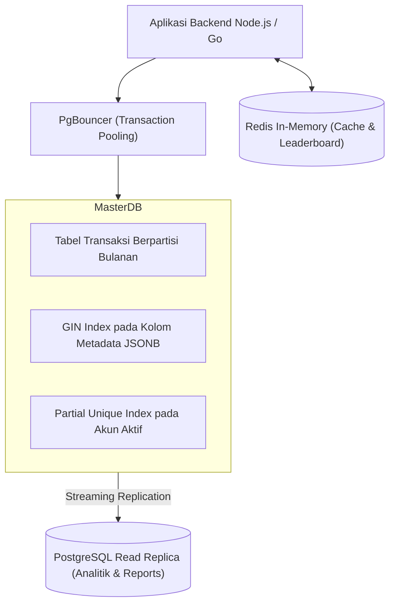

import Callout from '../../components/mdx/Callout.astro';

Selamat! Anda telah mempelajari seluruh pilar rekayasa basis data modern, mulai dari arsitektur penyimpanan PostgreSQL, strategi indexing B-Tree/GIN/GiST, pembedahan query plan dengan EXPLAIN ANALYZE, transaksi tingkat lanjut, partisi tabel, hingga caching in-memory Redis.

Pada tugas proyek akhir ini, Anda akan merancang dan mengoptimasi **Arsitektur Basis Data Skala Enterprise (High-Throughput E-Commerce & Financial Transaction Engine)**.

---

## 1. Spesifikasi Proyek Akhir

Anda diminta untuk menyusun berkas skema database `schema.sql` dan dokumentasi optimasi `TUNING_REPORT.md` yang mencakup:

---

## 2. Checklist Kriteria Penilaian

### A. Desain Skema & Tipe Data Optimal
- [ ] Penggunaan **UUID v7 (Time-Ordered)** atau **BIGINT Identity** pada seluruh tabel utama.
- [ ] Penerapan **Declarative Table Partitioning (Range Partitioning)** pada tabel `transactions` berdasarkan kolom `created_at`.
- [ ] Kolom metadata spesifikasi produk menggunakan tipe data **`JSONB`**.
- [ ] Integrity constraints terpasang lengkap (`CHECK`, `FOREIGN KEY ON DELETE RESTRICT/CASCADE`).

### B. Strategi Indexing & Query Tuning
- [ ] Pembuatan **Composite B-Tree Index** dengan mematuhi *Leftmost Prefix Rule*.
- [ ] Pembuatan **GIN Index** pada kolom JSONB untuk pencarian atribut produk instan.
- [ ] Pembuatan **Partial Index** khusus untuk transaksi dengan status `PENDING` yang membutuhkan penanganan cepat.
- [ ] Query analitik laporan performa penjualan bulanan ditulis menggunakan **Common Table Expressions (CTE)** dan **Window Functions (`RANK()`, `SUM() OVER`)**.

### C. Concurrency & Caching Layer
- [ ] Implementasi antrean pemrosesan pesanan menggunakan klausa `SELECT ... FOR UPDATE SKIP LOCKED` untuk mencegah konflik lock antar worker.
- [ ] Skrip integrasi caching Redis dengan pola **Cache-Aside** dan kebijakan eviction **`allkeys-lru`**.

---

## 3. Format Penyerahan Portofolio

1. Berkas **`schema.sql`**: Berisi seluruh perintah DDL pembuatan tabel, partisi, foreign key, dan indeks.
2. Berkas **`queries.sql`**: Berisi contoh kueri analitik dan transaksi berkecepatan tinggi.
3. Berkas **`TUNING_REPORT.md`**: Berisi penjelasan arsitektur, justifikasi pemilihan tipe indeks, dan perbandingan performa *Before vs After* optimasi query.

---

<Callout type="tip" title="Selamat Atas Pencapaian Luar Biasa Anda!">
  Dengan menuntaskan kursus ini, Anda telah memiliki keahlian langka yang membedakan seorang programmer biasa dengan seorang **Database Architect & Principal Performance Engineer**.
  
  Klik tombol **Tandai Selesai Pelajaran Ini** di bawah untuk melengkapi status kelulusan kursus Anda!
</Callout>
