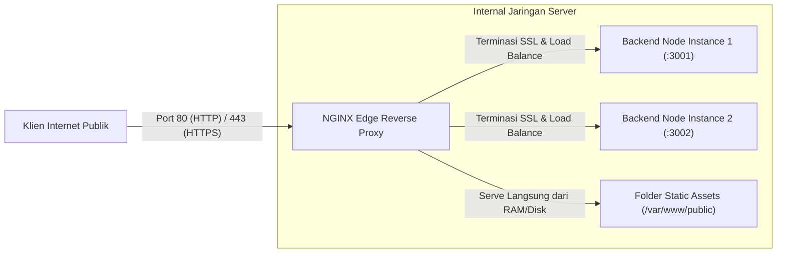

import Callout from '../../components/mdx/Callout.astro';

Mengapa aplikasi backend (seperti Node.js di port 3000 atau Python FastAPI di port 8000) **tidak boleh diekspos langsung ke internet publik**? Karena runtime aplikasi tidak dirancang untuk menangani beban tinggi koneksi TCP mentah, negosiasi enkripsi TLS/SSL yang boros CPU, kompresi Gzip, proteksi serangan Slowloris/DDoS, dan static asset caching. Di sinilah **NGINX** bertindak sebagai benteng terdepan (*Reverse Proxy & Edge Gateway*).

---

## 1. Arsitektur Reverse Proxy NGINX



---

## 2. Blueprint Konfigurasi NGINX (`/etc/nginx/sites-available/app.conf`)

```nginx
# 1. Definisi Upstream Load Balancing ke Multi-Instance Node.js
upstream backend_cluster {
    least_conn; # Algoritma: kirim ke server yang sedang melayani koneksi paling sedikit
    server 127.0.0.1:3001 max_fails=3 fail_timeout=10s;
    server 127.0.0.1:3002 max_fails=3 fail_timeout=10s;
    keepalive 32;
}

# 2. Redirect Otomatis HTTP (Port 80) ke HTTPS (Port 443)
server {
    listen 80;
    listen [::]:80;
    server_name api.awdcourse.id;

    return 301 https://$host$request_uri;
}

# 3. Blok Utama HTTPS (Port 443)
server {
    listen 443 ssl http2;
    listen [::]:443 ssl http2;
    server_name api.awdcourse.id;

    # Konfigurasi Sertifikat SSL / TLS
    ssl_certificate /etc/letsencrypt/live/api.awdcourse.id/fullchain.pem;
    ssl_certificate_key /etc/letsencrypt/live/api.awdcourse.id/privkey.pem;
    ssl_protocols TLSv1.2 TLSv1.3;
    ssl_ciphers HIGH:!aNULL:!MD5;
    ssl_prefer_server_ciphers on;

    # Optimasi Kompresi GZIP
    gzip on;
    gzip_types text/plain text/css application/json application/javascript text/xml;
    gzip_min_length 1024;

    # Security Headers
    add_header X-Frame-Options "SAMEORIGIN" always;
    add_header X-XSS-Protection "1; mode=block" always;
    add_header X-Content-Type-Options "nosniff" always;

    # Routing ke Backend API Cluster
    location / {
        proxy_pass http://backend_cluster;
        proxy_http_version 1.1;
        proxy_set_header Upgrade $http_upgrade;
        proxy_set_header Connection 'upgrade';
        proxy_set_header Host $host;
        proxy_set_header X-Real-IP $remote_addr;
        proxy_set_header X-Forwarded-For $proxy_add_x_forwarded_for;
        proxy_set_header X-Forwarded-Proto $scheme;

        # Timeout settings
        proxy_connect_timeout 60s;
        proxy_read_timeout 60s;
    }

    # Static Assets Caching Cepat
    location /static/ {
        alias /var/www/my-app/public/;
        expires 30d;
        add_header Cache-Control "public, no-transform";
    }
}
```

---

## 3. Otomatisasi Sertifikat SSL Gratis dengan Let's Encrypt & Certbot

Dengan tool **Certbot**, instalasi dan perpanjangan otomatis sertifikat HTTPS dapat dilakukan hanya dengan 2 perintah:

```bash
# 1. Pasang Certbot & plugin NGINX di Ubuntu Server
sudo apt update && sudo apt install -y certbot python3-certbot-nginx

# 2. Terbitkan sertifikat SSL otomatis (Certbot akan memodifikasi konfigurasi NGINX)
sudo certbot --nginx -d api.awdcourse.id

# 3. Uji perpanjangan otomatis (Renewal Dry-Run)
sudo certbot renew --dry-run
```

<Callout type="tip" title="Header X-Forwarded-For">
  Karena request klien melewati NGINX terlebih dahulu, Node.js secara default hanya melihat IP NGINX (`127.0.0.1`). Pastikan menyertakan `proxy_set_header X-Real-IP $remote_addr;` dan di Express tambahkan `app.set('trust proxy', 1);` agar pembatasan rate limiting IP klien asli berfungsi akurat.
</Callout>
