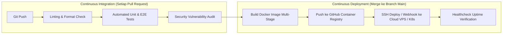

import Callout from '../../components/mdx/Callout.astro';

Mendeploy kode ke server secara manual via FTP atau SSH langsung dari laptop developer memiliki banyak resiko: developer lupa menjalankan unit test, ada perbedaan versi library, atau password server bocor. **CI/CD (*Continuous Integration / Continuous Deployment*)** mengotomatiskan seluruh tahapan mulai dari commit kode hingga aplikasi live di server.

---

## 1. Perbedaan Mendasar: CI vs CD



- **Continuous Integration (CI)**: Memastikan setiap perubahan kode baru secara otomatis diuji (*unit testing* & *linting*) agar tidak merusak fungsi yang sudah ada (*Regression Bug*).
- **Continuous Deployment (CD)**: Jika seluruh pengujian CI lolos, sistem akan otomatis merilis aplikasi baru ke server produksi tanpa intervensi manual.

---

## 2. Blueprint Workflow GitHub Actions (`.github/workflows/deploy.yml`)

```yaml
name: Production CI/CD Pipeline

# Trigger saat ada push ke branch main atau pull request baru
on:
  push:
    branches: [main]
  pull_request:
    branches: [main]

env:
  REGISTRY: ghcr.io
  IMAGE_NAME: ${{ github.repository }}

jobs:
  # ==========================================
  # JOB 1: Test & Quality Gate (CI)
  # ==========================================
  test_and_lint:
    runs-on: ubuntu-latest
    steps:
      - name: Checkout Source Code
        uses: actions/checkout@v4

      - name: Setup Node.js Environment
        uses: actions/setup-node@v4
        with:
          node-version: 22
          cache: 'npm' # Mengaktifkan caching dependencies agar build cepat

      - name: Install Dependencies
        run: npm ci

      - name: Run ESLint & Prettier Check
        run: npm run lint --if-present

      - name: Execute Automated Unit Tests
        run: npm test --if-present

  # ==========================================
  # JOB 2: Build & Push Docker Image (CD)
  # ==========================================
  build_and_publish:
    needs: test_and_lint # Hanya jalan jika JOB 1 LULUS!
    if: github.ref == 'refs/heads/main' && github.event_name == 'push'
    runs-on: ubuntu-latest
    permissions:
      contents: read
      packages: write

    steps:
      - name: Checkout Code
        uses: actions/checkout@v4

      - name: Set up Docker Buildx (Layer Caching)
        uses: docker/setup-buildx-action@v3

      - name: Log in to GitHub Container Registry (GHCR)
        uses: docker/login-action@v3
        with:
          registry: ${{ env.REGISTRY }}
          username: ${{ github.actor }}
          password: ${{ secrets.GITHUB_TOKEN }}

      - name: Extract Docker Metadata (Tags & Labels)
        id: meta
        uses: docker/metadata-action@v5
        with:
          images: ${{ env.REGISTRY }}/${{ env.IMAGE_NAME }}
          tags: |
            type=raw,value=latest
            type=sha,format=short

      - name: Build and Push Docker Image
        uses: docker/build-push-action@v5
        with:
          context: .
          push: true
          tags: ${{ steps.meta.outputs.tags }}
          labels: ${{ steps.meta.outputs.labels }}
          cache-from: type=gha
          cache-to: type=gha,mode=max

  # ==========================================
  # JOB 3: Deploy to Production Cloud Server
  # ==========================================
  deploy_to_server:
    needs: build_and_publish
    runs-on: ubuntu-latest
    steps:
      - name: Execute Remote SSH Commands
        uses: appleboy/ssh-action@v1.0.3
        with:
          host: ${{ secrets.PROD_SERVER_HOST }}
          username: ${{ secrets.PROD_SERVER_USER }}
          key: ${{ secrets.PROD_SSH_PRIVATE_KEY }}
          script: |
            cd /opt/my-app
            docker compose pull api_service
            docker compose up -d --no-deps api_service
            docker system prune -f
            echo "🚀 Deployment Berhasil Selesai!"
```

---

## 3. Manajemen Kunci Rahasia (GitHub Secrets)

Jangan pernah menulis token API atau SSH Key di file `.yml`. Simpan kredensial pada menu:
`GitHub Repo > Settings > Secrets and variables > Actions > New repository secret`.

Kredensial penting yang wajib disimpan:
- `PROD_SERVER_HOST`: Alamat IP Server VPS Anda.
- `PROD_SERVER_USER`: Username SSH (misal: `ubuntu` atau `deployer`).
- `PROD_SSH_PRIVATE_KEY`: Private Key SSH server.

<Callout type="tip" title="Zero-Downtime Deployment (Rolling Update)">
  Dengan perintah `docker compose up -d --no-deps api_service`, Docker Compose akan menyalakan kontainer baru terlebih dahulu sebelum mematikan kontainer lama, sehingga pengguna tidak mengalami error saat deployment berlangsung.
</Callout>
