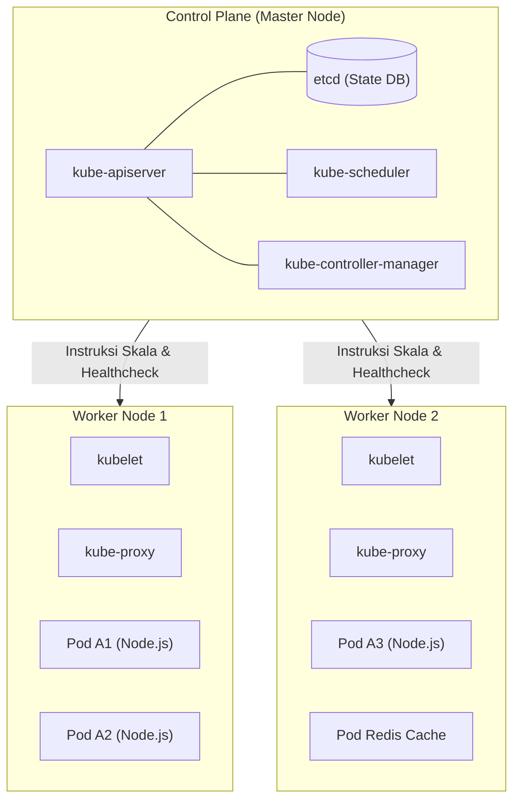

import Callout from '../../components/mdx/Callout.astro';

Ketika aplikasi Anda dijalankan di puluhan server cluster dengan ribuan kontainer aktif, Docker Compose di satu VPS tidak lagi memadai. Jika satu server fisik terbakar atau mati lampu, bagaimana kontainer Anda otomatis pindah ke server lain tanpa memutus layanan pengguna? **Kubernetes (K8s)** adalah platform orkestrasi kontainer open-source yang dirancang oleh Google untuk mengotomatiskan deployment, scaling, dan manajemen aplikasi terkontainerisasi.

---

## 1. Arsitektur Komponen Kubernetes



---

## 2. Konsep Objek Inti Kubernetes

1. **Pod**: Unit komputasi terkecil di K8s. Membungkus 1 atau lebih kontainer yang berbagi alamat IP dan storage volume yang sama.
2. **Deployment**: Pengendali deklaratif yang mengatur jumlah replika Pod, rolling update versi baru, dan rollback otomatis.
3. **Service**: Abstraksi jaringan stabil (ClusterIP, NodePort, LoadBalancer) yang mengarahkan trafik ke kumpulan Pod yang sehat.
4. **Ingress**: Router pintu masuk HTTP/HTTPS yang mengatur domain, path routing, dan SSL termination menuju Service.
5. **ConfigMap & Secret**: Pemisahan konfigurasi dan kredensial rahasia dari image aplikasi.

---

## 3. Menulis Manifest Kubernetes Produksi (`deployment.yaml`)

```yaml
# ==========================================
# 1. DEPLOYMENT (Replika & Rolling Update)
# ==========================================
apiVersion: apps/v1
kind: Deployment
metadata:
  name: backend-api-deployment
  labels:
    app: backend-api
spec:
  replicas: 3 # Menjalankan 3 Pod secara simultan
  selector:
    matchLabels:
      app: backend-api
  template:
    metadata:
      labels:
        app: backend-api
    spec:
      containers:
        - name: api-container
          image: ghcr.io/username/my-backend:latest
          imagePullPolicy: Always
          ports:
            - containerPort: 3000
          
          # Alokasi Resource Limit (Penting agar tidak memakan seluruh CPU node)
          resources:
            requests:
              memory: "128Mi"
              cpu: "100m"
            limits:
              memory: "512Mi"
              cpu: "500m"

          # Healthcheck Probes (Self-Healing K8s)
          livenessProbe:
            httpGet:
              path: /health/live
              port: 3000
            initialDelaySeconds: 15
            periodSeconds: 10

          readinessProbe:
            httpGet:
              path: /health/ready
              port: 3000
            initialDelaySeconds: 5
            periodSeconds: 5

          envFrom:
            - configMapRef:
                name: app-config
            - secretRef:
                name: app-secrets

---
# ==========================================
# 2. SERVICE (Internal Load Balancing)
# ==========================================
apiVersion: v1
kind: Service
metadata:
  name: backend-api-service
spec:
  type: ClusterIP
  selector:
    app: backend-api
  ports:
    - protocol: TCP
      port: 80
      targetPort: 3000
```

---

## 4. Autoscaling Otomatis: Horizontal Pod Autoscaler (HPA)

Ketika terjadi lonjakan trafik (misal kampanye diskon tanggal kembar), Kubernetes dapat secara otomatis menambah jumlah Pod dari 3 menjadi 20 Pod:

```yaml
apiVersion: autoscaling/v2
kind: HorizontalPodAutoscaler
metadata:
  name: backend-api-hpa
spec:
  scaleTargetRef:
    apiVersion: apps/v1
    kind: Deployment
    name: backend-api-deployment
  minReplicas: 2
  maxReplicas: 15
  metrics:
    - type: Resource
      resource:
        name: cpu
        target:
          type: Utilization
          averageUtilization: 70 # Jika rata-rata CPU > 70%, buat Pod baru!
```

<Callout type="tip" title="Self-Healing Kubernetes">
  Jika sebuah kontainer di dalam Pod mengalami *crash* karena memory leak (`OutOfMemory`), `livenessProbe` akan gagal dan Kubernetes secara otomatis mematikan kontainer lama lalu membuat kontainer baru yang segar dalam hitungan detik.
</Callout>
