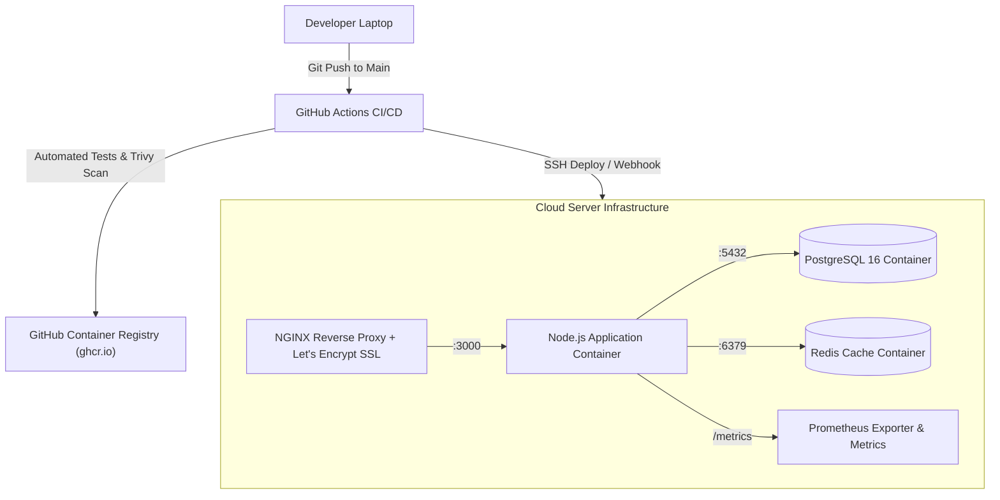

import Callout from '../../components/mdx/Callout.astro';

Selamat atas dedikasi Anda dalam mempelajari seluruh ekosistem DevOps & Cloud Deployment modern! Pada tugas proyek akhir ini, Anda akan menyatukan seluruh pengetahuan menjadi satu alur implementasi nyata yang siap ditunjukkan sebagai portofolio keahlian DevOps tingkat lanjut.

---

## 1. Spesifikasi Tugas Proyek Akhir

Anda diminta untuk merancang dan mendeploy sebuah arsitektur aplikasi fullstack lengkap ke lingkungan Cloud (VPS / DigitalOcean / AWS / GCP / Railway) dengan spesifikasi:

---

## 2. Checklist Kriteria Kelulusan Proyek

### A. Kontainerisasi (Docker & Compose)
- [ ] Terdapat `Dockerfile` yang menggunakan pola **Multi-Stage Build** berbasis image Alpine minimalis.
- [ ] Terdapat `.dockerignore` yang mencegah upload berkas `node_modules` dan `.env`.
- [ ] Kontainer dijalankan dengan **User Non-Root** (`USER node`).
- [ ] Berkas `docker-compose.yml` mengorkestrasi minimal 3 service: Aplikasi Web, PostgreSQL dengan Persistent Volume, dan Redis.
- [ ] Terdapat mekanisme `healthcheck` dan `depends_on: condition: service_healthy`.

### B. Otomatisasi Pipeline CI/CD (GitHub Actions)
- [ ] Pipeline otomatis berjalan pada trigger `push` dan `pull_request` ke branch `main`.
- [ ] Tahap CI menjalankan linting dan unit testing otomatis.
- [ ] Tahap CD membangun Docker image, memberi tag (`latest` dan short commit SHA), lalu mem-push image ke Container Registry.
- [ ] Terdapat langkah otomatis untuk memicu update container di server produksi dengan *Zero-Downtime*.

### C. Keamanan Jaringan & Web Server (NGINX + SSL)
- [ ] NGINX bertindak sebagai reverse proxy terdepan.
- [ ] Sertifikat HTTPS/SSL terpasang aktif menggunakan Let's Encrypt / Certbot dengan auto-renew.
- [ ] Seluruh trafik HTTP port 80 dialihkan (*redirect*) ke HTTPS port 443.
- [ ] Security Headers (`X-Frame-Options`, `X-Content-Type-Options`) terpasang.

### D. Observabilitas & Monitoring
- [ ] Aplikasi menggunakan structured JSON logging.
- [ ] Endpoint `/health/live` dan `/health/ready` tersedia untuk pemantauan ketersediaan layanan.

---

## 3. Format Penyerahan Proyek (Submission)

1. Tautan ke **Repositori GitHub Publik** yang memuat:
   - `Dockerfile` & `.dockerignore`
   - `docker-compose.yml`
   - `.github/workflows/deploy.yml`
   - `nginx.conf`
   - `README.md` terstruktur dengan instruksi instalasi dan diagram arsitektur.
2. Tautan ke **URL Domain / Subdomain Aktif** yang dapat diakses melalui browser dengan protokol HTTPS yang valid.

---

<Callout type="tip" title="Selamat Atas Kelulusan Anda!">
  Dengan menuntaskan proyek akhir ini, Anda telah memiliki kompetensi praktis tingkat lanjut sebagai seorang **DevOps & Cloud Engineer** yang mampu mengelola infrastruktur modern berskala produksi!
  
  Klik tombol **Tandai Selesai Pelajaran Ini** di bawah untuk melengkapi status kelulusan kursus Anda.
</Callout>
