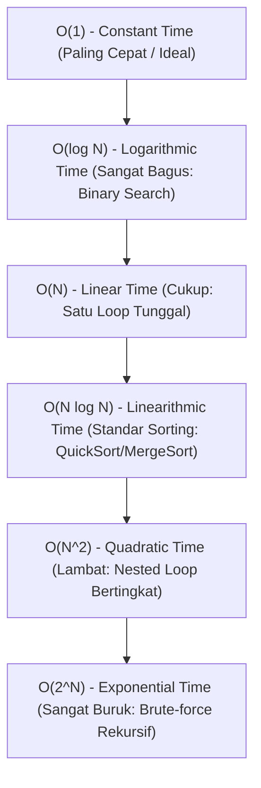

import Callout from '../../components/mdx/Callout.astro';
import MultiLangRunner from '../../components/mdx/MultiLangRunner.astro';

Selamat datang di kursus komprehensif **Struktur Data, Algoritma & Rekayasa Perangkat Lunak Modern**! Mengapa software engineer handal perlu memahami struktur data dan algoritma? Karena perbedaan antara algoritma yang efisien dan algoritma yang ceroboh adalah perbedaan antara website yang merespon dalam **2 milidetik** vs server yang **hang/crash** saat menerima 100.000 data pengguna.

---

## 1. Apa itu Notasi Big-O?

**Notasi Big-O** (`O`) adalah cara matematis untuk mengukur bagaimana waktu eksekusi (*Time Complexity*) atau penggunaan memori (*Space Complexity*) suatu algoritma bertumbuh seiring dengan bertambahnya ukuran input data (`N`).

### Panduan Skala Kecepatan Big-O:

| Notasi Big-O | Nama | Operasi untuk N = 1.000 | Contoh Nyata |
| :--- | :--- | :--- | :--- |
| `O(1)` | Constant | **1 operasi** | Mengambil elemen array berdasarkan index (`arr[0]`), Lookup key pada Hash Map |
| `O(log N)` | Logarithmic | **~10 operasi** | Binary Search pada array terurut |
| `O(N)` | Linear | **1.000 operasi** | Linear Search, membaca seluruh elemen array sekali |
| `O(N log N)` | Linearithmic | **~10.000 operasi** | Algoritma MergeSort, QuickSort, Timsort |
| `O(N^2)` | Quadratic | **1.000.000 operasi** | Nested Loop bertingkat (Bubble Sort, perbandingan pasangan brute-force) |
| `O(2^N)` | Exponential | **10^300 operasi** (Membekukan server!) | Brute-force mencari kombinasi subset |

---

## 2. Best-Case, Average-Case, dan Worst-Case

1. **Worst-Case (`O`)**: Skenario terburuk yang mungkin dihadapi algoritma (ini adalah metrik standar yang wajib kita rancang agar sistem selalu tangguh).
2. **Average-Case (`Theta`)**: Ekspektasi performa rata-rata pada input acak di dunia nyata.
3. **Best-Case (`Omega`)**: Skenario terbaik (misal data sudah dalam kondisi terurut sejak awal).

<Callout type="note" title="Aturan Penyederhanaan Big-O">
  Saat menghitung Big-O:
  1. **Abaikan Konstanta**: `O(2N + 5)` disederhanakan menjadi `O(N)`.
  2. **Ambil Suku Dominan Tertinggi**: `O(N^2 + 100N)` disederhanakan menjadi `O(N^2)`.
</Callout>

---

## 3. Praktik Interaktif: Uji Nyata Kecepatan O(N) vs O(N^2)

Jalankan live sandbox di bawah ini untuk membuktikan bagaimana algoritma `O(N^2)` menjadi ribuan kali lebih lambat saat ukuran data meningkat:

<MultiLangRunner
  language="javascript"
  title="Benchmarking Nyata: Linear O(N) vs Quadratic O(N^2)"
  initialCode={`// Generator data array acak berukuran N
function generateRandomArray(size) {
  const arr = [];
  for (let i = 0; i < size; i++) {
    arr.push(Math.floor(Math.random() * 100000));
  }
  return arr;
}

// 1. Algoritma O(N) - Linear Search / Max Value Finder
function findMaxLinear(arr) {
  let max = arr[0];
  for (let i = 1; i < arr.length; i++) {
    if (arr[i] > max) max = arr[i];
  }
  return max;
}

// 2. Algoritma O(N^2) - Brute-force Duplicate Pair Checker
function hasDuplicateQuadratic(arr) {
  for (let i = 0; i < arr.length; i++) {
    for (let j = i + 1; j < arr.length; j++) {
      if (arr[i] === arr[j]) return true;
    }
  }
  return false;
}

// 3. Algoritma O(N) dengan Hash Set - Optimized Duplicate Checker
function hasDuplicateLinear(arr) {
  const seen = new Set();
  for (let i = 0; i < arr.length; i++) {
    if (seen.has(arr[i])) return true;
    seen.add(arr[i]);
  }
  return false;
}

function runBenchmark() {
  const DATA_SIZE = 10000;
  console.log(\`🚀 Menjalankan pengujian performa dengan \${DATA_SIZE.toLocaleString()} elemen data...\\n\`);
  const data = generateRandomArray(DATA_SIZE);

  // Uji Algoritma O(N)
  const t1 = performance.now();
  findMaxLinear(data);
  const dur1 = performance.now() - t1;
  console.log(\`✅ Algoritma O(N) Linear Search -> Waktu: \${dur1.toFixed(3)} ms\`);

  // Uji Algoritma O(N) Hash Set
  const t2 = performance.now();
  hasDuplicateLinear(data);
  const dur2 = performance.now() - t2;
  console.log(\`✅ Algoritma O(N) Hash Set Duplicate -> Waktu: \${dur2.toFixed(3)} ms\`);

  // Uji Algoritma O(N^2) Nested Loop
  const t3 = performance.now();
  hasDuplicateQuadratic(data);
  const dur3 = performance.now() - t3;
  console.log(\`⚠️ Algoritma O(N^2) Quadratic Nested Loop -> Waktu: \${dur3.toFixed(3)} ms\`);

  console.log(\`\\n⚡ Kesimpulan: Algoritma O(N) sekitar \${(dur3 / (dur2 || 0.01)).toFixed(0)}x lebih cepat dibanding O(N^2)!\`);
}

runBenchmark();`}
/>

<Callout type="tip" title="Pentingnya Space Complexity">
  Selain kecepatan waktu, perhatikan juga penggunaan memori (*Space Complexity*). Menggunakan Hash Set pada kode di atas memakan memori tambahan `O(N)` sebagai ganti dari kecepatan eksekusi yang melonjak drastis. Ini dikenal sebagai *Time-Space Trade-off*.
</Callout>
