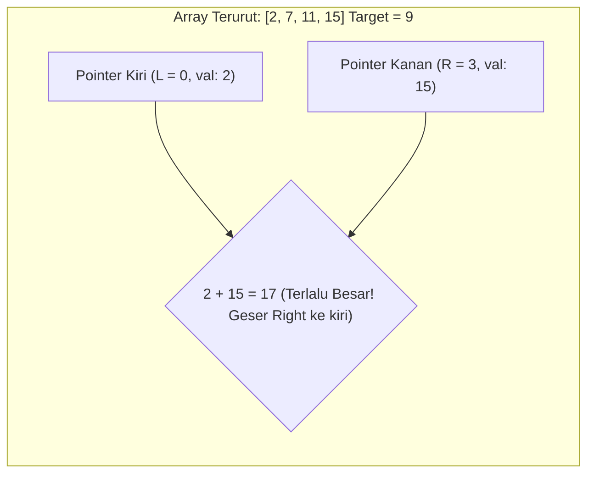

import Callout from '../../components/mdx/Callout.astro';
import MultiLangRunner from '../../components/mdx/MultiLangRunner.astro';

**Array** adalah struktur data linier paling dasar di mana elemen-elemen disimpan dalam blok memori fisik yang berurutan (*Contiguous Memory*). Karena alamat memori berdekatan, kita dapat mengakses elemen manapun secara instan `O(1)` melalui indeks (`arr[i] = BaseAddress + i * ElementSize`).

---

## 1. Pola Two Pointers (Dua Penunjuk)

Teknik **Two Pointers** menggunakan dua variabel penunjuk (biasanya satu dari ujung kiri `left = 0` dan satu dari ujung kanan `right = arr.length - 1`) untuk memecahkan masalah pencarian atau pembalikan data dalam satu kali lewatan linear `O(N)`, menghindari *nested loop* `O(N^2)`.



### Kasus Klasik: Two Sum II (Input Array Terurut)
```javascript
function twoSumSorted(numbers, target) {
  let left = 0;
  let right = numbers.length - 1;

  while (left < right) {
    const sum = numbers[left] + numbers[right];
    if (sum === target) {
      return [left, right]; // Pasangan ditemukan!
    } else if (sum < target) {
      left++; // Jumlah terlalu kecil, geser penunjuk kiri ke angka lebih besar
    } else {
      right--; // Jumlah terlalu besar, geser penunjuk kanan ke angka lebih kecil
    }
  }

  return []; // Tidak ditemukan
}
```

---

## 2. Pola Sliding Window (Jendela Geser)

Pola **Sliding Window** digunakan untuk menyelesaikan masalah yang melibatkan sub-array atau sub-string berurutan (misal: mencari jumlah sub-array berukuran `K` terbesar, atau sub-string unik terpanjang).

Alih-alih menghitung ulang seluruh elemen di dalam jendela setiap pergeseran (`O(N * K)`), kita hanya **mengurangi elemen yang keluar** dari jendela dan **menambahkan elemen baru yang masuk** ke jendela dalam `O(1)`!

---

## 3. Praktik Interaktif: Implementasi Two Pointers & Sliding Window

Eksplorasi kedua teknik optimasi algoritma ini di sandbox interaktif:

<MultiLangRunner
  language="javascript"
  title="Interactive Two Pointers & Sliding Window Engine"
  initialCode={`// 1. TEKNIK TWO POINTERS: Membalik String / Cek Palindrome In-Place
function isPalindrome(str) {
  // Bersihkan karakter non-alfanumerik
  const cleaned = str.toLowerCase().replace(/[^a-z0-9]/g, "");
  let left = 0;
  let right = cleaned.length - 1;

  while (left < right) {
    if (cleaned[left] !== cleaned[right]) {
      return false; // Bukan palindrome
    }
    left++;
    right--;
  }
  return true;
}

// 2. TEKNIK SLIDING WINDOW: Mencari Jumlah Subarray Maksimum Berukuran K
function maxSubarraySum(arr, k) {
  if (arr.length < k) return null;

  let maxSum = 0;
  let currentWindowSum = 0;

  // Hitung jumlah jendela pertama berukuran K
  for (let i = 0; i < k; i++) {
    currentWindowSum += arr[i];
  }
  maxSum = currentWindowSum;

  // Geser jendela dari indeks K hingga akhir array
  for (let i = k; i < arr.length; i++) {
    // Kurangi elemen yang keluar dari kiri (arr[i - k]) dan tambah elemen baru di kanan (arr[i])
    currentWindowSum = currentWindowSum - arr[i - k] + arr[i];
    maxSum = Math.max(maxSum, currentWindowSum);
  }

  return maxSum;
}

// --- PENGUJIAN ---
console.log("=== 1. UJI COBA PALINDROME (Two Pointers) ===");
console.log("'Kasur ini rusak' ->", isPalindrome("Kasur ini rusak")); // true
console.log("'A man, a plan, a canal: Panama' ->", isPalindrome("A man, a plan, a canal: Panama")); // true
console.log("'Backend Developer' ->", isPalindrome("Backend Developer")); // false

console.log("\\n=== 2. UJI COBA SLIDING WINDOW (Max Subarray Sum K=3) ===");
const transaksi = [120, 350, 410, 200, 700, 650, 150, 800];
// Mencari total 3 transaksi berturut-turut tertinggi
console.log("Daftar Transaksi:", transaksi);
console.log("Total Maksimum 3 Hari Berturut-turut:", maxSubarraySum(transaksi, 3));`}
/>

<Callout type="tip" title="Kapan Menggunakan Sliding Window?">
  Gunakan Sliding Window jika persoalan meminta Anda mencari elemen "kontigu" (*contiguous* / berurutan) seperti sub-array maksimum, sub-string tanpa karakter berulang, atau batas anggaran rolling period.
</Callout>
