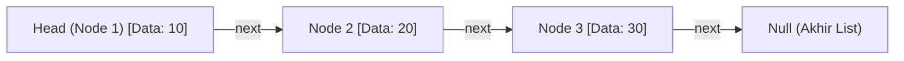

import Callout from '../../components/mdx/Callout.astro';
import MultiLangRunner from '../../components/mdx/MultiLangRunner.astro';

Ketika Anda memasukkan elemen baru di awal array statis (`arr.unshift(1)`), komputer harus menggeser seluruh elemen yang ada ke kanan satu per satu (`O(N)`). Struktur data **Linked List** memecahkan keterbatasan ini dengan menghubungkan node-node memori menggunakan pointer penunjuk.

---

## 1. Linked List: Singly vs Doubly Linked List

Setiap elemen (Node) dalam **Linked List** menyimpan dua hal:
1. **Data / Value**: Isi informasi (angka, teks, objek).
2. **Next Pointer**: Alamat memori yang menunjuk ke Node berikutnya di RAM.



### Kelebihan & Kekurangan Linked List:
- **Kelebihan**: Penambahan/penghapusan elemen di awal (*Head*) adalah `O(1)` instan tanpa alokasi ulang array.
- **Kekurangan**: Tidak ada akses acak berbasis indeks (`arr[5]`), pencarian elemen tetap `O(N)` karena harus menelusuri dari *Head*.

---

## 2. Stack: Last-In, First-Out (LIFO)

**Stack (Tumpukan)** beroperasi dengan prinsip elemen terakhir yang masuk adalah yang pertama keluar (seperti tumpukan piring).

```text
       ┌───────────┐
Push   │  Item C   │ ──> Pop (Keluar duluan)
       ├───────────┤
       │  Item B   │
       ├───────────┤
       │  Item A   │
       └───────────┘ (Dasar Stack)
```

### Kasus Penggunaan Nyata Stack:
1. **Call Stack Eksekusi Program**: Melacak fungsi mana yang sedang berjalan di CPU.
2. **Fitur Undo / Redo**: Aplikasi grafis (Photoshop/Figma) dan Text Editor.
3. **Pengecekan Tanda Kurung Berimbang (*Balanced Parentheses*)** di Compiler/Linter.

---

## 3. Queue: First-In, First-Out (FIFO)

**Queue (Antrean)** beroperasi dengan prinsip yang pertama datang adalah yang pertama dilayani (seperti antrean kasir tiket).

### Kasus Penggunaan Nyata Queue:
1. **Message Queue / Job Worker** (RabbitMQ, Redis Queue, BullMQ).
2. **Printer Spooling**: Dokumen pertama yang dikirim akan dicetak terlebih dahulu.
3. **Breadth-First Search (BFS)** pada Graf dan Pohon.

---

## 4. Praktik Interaktif: Balanced Parentheses Parser Menggunakan Stack

Jalankan sandbox di bawah ini untuk melihat implementasi nyata algoritma validasi sintaksis tanda kurung `()`, `{}`, `[]` yang digunakan oleh kompilator:

<MultiLangRunner
  language="javascript"
  title="Implementasi Stack & Balanced Parentheses Parser"
  initialCode={`// Implementasi Struktur Data Stack Mandiri
class CustomStack {
  constructor() {
    this.items = [];
  }

  push(element) {
    this.items.push(element);
  }

  pop() {
    if (this.isEmpty()) return null;
    return this.items.pop();
  }

  peek() {
    return this.items[this.items.length - 1];
  }

  isEmpty() {
    return this.items.length === 0;
  }

  size() {
    return this.items.length;
  }
}

// Algoritma Parser Validasi Tanda Kurung Berimbang
function isValidParentheses(codeSnippet) {
  const stack = new CustomStack();
  const pairs = {
    ")": "(",
    "}": "{",
    "]": "["
  };

  for (let i = 0; i < codeSnippet.length; i++) {
    const char = codeSnippet[i];

    // Jika tanda kurung buka, masukkan ke stack
    if (char === "(" || char === "{" || char === "[") {
      stack.push(char);
    } 
    // Jika tanda kurung tutup
    else if (char === ")" || char === "}" || char === "]") {
      if (stack.isEmpty()) return false; // Kurung tutup tanpa pasangan buka
      
      const top = stack.pop();
      if (top !== pairs[char]) {
        return false; // Pasangan tidak cocok (misal '{' ditutup dengan ')')
      }
    }
  }

  // Jika stack kosong di akhir, berarti seluruh kurung berimbang sempurna
  return stack.isEmpty();
}

// --- PENGUJIAN ---
console.log("=== PENGUJIAN BALANCED PARENTHESES ===");
const code1 = "function calculateTotal(price, qty) { return (price * qty) + [10, 20][0]; }";
console.log("Code 1 Valid? ->", isValidParentheses(code1)); // true

const code2 = "const arr = [(1 + 2) * { 3 + 4 }];";
console.log("Code 2 Valid? ->", isValidParentheses(code2)); // true

const code3 = "const broken = (1 + 2 * [3 + 4);"; // Kurung tutup salah
console.log("Code 3 Valid? ->", isValidParentheses(code3)); // false

const code4 = "function test() { return 10;"; // Kurung kurawal tidak pernah ditutup
console.log("Code 4 Valid? ->", isValidParentheses(code4)); // false`}
/>

<Callout type="tip" title="Kompleksitas Stack">
  Operasi `push()`, `pop()`, dan `peek()` pada Stack selalu memiliki kompleksitas waktu konstan `O(1)`.
</Callout>
