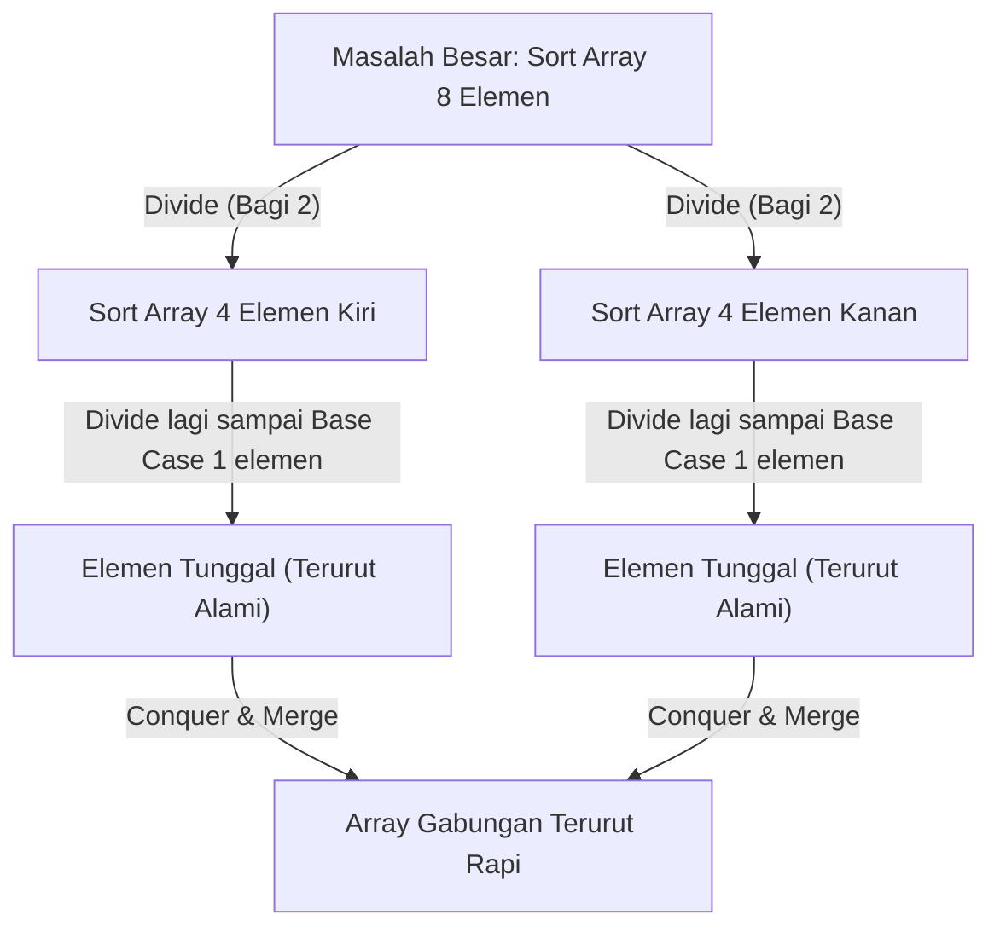

import Callout from '../../components/mdx/Callout.astro';
import MultiLangRunner from '../../components/mdx/MultiLangRunner.astro';

Dua konsep paling mendasar dalam ilmu komputer adalah **Pencarian (*Searching*)** dan **Pengurutan (*Sorting*)**. Tanpa algoritma pencarian yang cepat, mesin pencari seperti Google tidak akan mampu menemukan 1 dokumen di antara 50 miliar halaman web dalam 0.05 detik.

---

## 1. Konsep Rekursi & Paradigma Divide and Conquer

**Rekursi** adalah teknik di mana suatu fungsi memanggil dirinya sendiri untuk memecah masalah besar menjadi sub-masalah yang lebih kecil.

### 2 Bagian Wajib Fungsi Rekursif:
1. **Base Case (Kondisi Berhenti)**: Kondisi mutlak saat rekursi harus berhenti dan mengembalikan nilai. Tanpa base case, program akan mengalami *Stack Overflow Error* (Call Stack memori habis).
2. **Recursive Step**: Pemanggilan fungsi dengan argumen yang semakin mendekati base case.

---

## 2. Binary Search: Kecepatan Logaritmik O(log N)

Jika array **sudah dalam kondisi terurut**, kita tidak perlu memeriksa elemen satu per satu dari awal (`O(N)`). Kita dapat memeriksa elemen tengah (*mid*), lalu mengabaikan separuh array yang tidak relevan:

Pada data dengan **1.000.000 elemen**:
- Linear Search membutuhkan rata-rata **500.000 langkah**.
- Binary Search membutuhkan maksimal **hanya 20 langkah**! (`log2(1.000.000) ~ 20`).

---

## 3. Perbandingan Algoritma Pengurutan (Sorting)

| Algoritma | Best Case | Average Case | Worst Case | Space Complexity | Stabilitas |
| :--- | :--- | :--- | :--- | :--- | :--- |
| **Bubble / Selection Sort** | `O(N^2)` | `O(N^2)` | `O(N^2)` | `O(1)` | Stabil |
| **Merge Sort** | `O(N log N)` | `O(N log N)` | `O(N log N)` | `O(N)` | Stabil |
| **QuickSort** | `O(N log N)` | `O(N log N)` | `O(N^2)` (jarang) | `O(log N)` | Tidak Stabil |

---

## 4. Praktik Interaktif: Binary Search & QuickSort Engine

Jalankan live sandbox di bawah ini untuk melihat implementasi rekursif QuickSort dan Binary Search:

<MultiLangRunner
  language="javascript"
  title="Implementasi Rekursif QuickSort & Binary Search"
  initialCode={`// 1. ALGORITMA REKURSIF QUICKSORT (O(N log N))
function quickSort(arr) {
  // Base Case: Array dengan 0 atau 1 elemen sudah otomatis terurut
  if (arr.length <= 1) return arr;

  // Pilih Pivot (elemen tengah)
  const pivotIndex = Math.floor(arr.length / 2);
  const pivot = arr[pivotIndex];
  
  const left = [];
  const middle = [];
  const right = [];

  for (let i = 0; i < arr.length; i++) {
    if (arr[i] < pivot) {
      left.push(arr[i]);
    } else if (arr[i] > pivot) {
      right.push(arr[i]);
    } else {
      middle.push(arr[i]);
    }
  }

  // Rekursif divide and conquer
  return [...quickSort(left), ...middle, ...quickSort(right)];
}

// 2. ALGORITMA BINARY SEARCH (O(log N))
function binarySearch(sortedArr, target) {
  let left = 0;
  let right = sortedArr.length - 1;
  let iterations = 0;

  while (left <= right) {
    iterations++;
    const mid = Math.floor((left + right) / 2);

    if (sortedArr[mid] === target) {
      return { found: true, index: mid, iterations };
    }

    if (sortedArr[mid] < target) {
      left = mid + 1; // Cari di separuh kanan
    } else {
      right = mid - 1; // Cari di separuh kiri
    }
  }

  return { found: false, index: -1, iterations };
}

// --- PENGUJIAN ---
const rawData = [45, 12, 89, 3, 27, 99, 56, 18, 71, 33];
console.log("Data Awal (Acak):", rawData);

const sortedData = quickSort(rawData);
console.log("Hasil QuickSort:", sortedData);

console.log("\\n=== PENCARIAN BINARY SEARCH PADA DATA TERURUT ===");
const target = 56;
const result = binarySearch(sortedData, target);
console.log(\`Mencari nilai \${target} -> Hasil:\`, result);`}
/>

<Callout type="tip" title="Kapan Memilih MergeSort vs QuickSort?">
  **MergeSort** menjamin performa `O(N log N)` di seluruh skenario dan bersifat *stabil*, namun membutuhkan memori tambahan `O(N)`. **QuickSort** bekerja secara *in-place* dengan cache CPU yang sangat efisien sehingga menjadi algoritma default di banyak pustaka bahasa pemrograman standar (seperti `Array.prototype.sort`).
</Callout>
