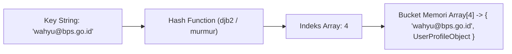

import Callout from '../../components/mdx/Callout.astro';
import MultiLangRunner from '../../components/mdx/MultiLangRunner.astro';

Jika Anda bertanya kepada software engineer senior: *"Struktur data apa yang paling sering digunakan untuk mengoptimasi sistem di industri?"*, jawabannya hampir pasti adalah **Hash Table (Hash Map / Objek / Dictionary)**. Hash Table memungkinkan kita menyimpan dan mengambil data dengan kecepatan konstan `O(1)` instan!

---

## 1. Bagaimana Hash Table Bekerja di Balik Layar?

Hash Table adalah struktur data berbasis array yang menggunakan fungsi matematika khusus bernama **Hash Function** untuk mengonversi sembarang *Key* (misal string `"user_budi"`) menjadi sebuah indeks integer array:



---

## 2. Masalah Hash Collision & Solusinya

Karena jumlah kemungkinan string tak terhingga sedangkan ukuran array penyimpanan terbatas, dua string berbeda bisa saja menghasilkan indeks hash yang sama (dikenal sebagai **Hash Collision**).

### 2 Metode Penanganan Collision Standar:
1. **Separate Chaining**: Setiap indeks array menyimpan sebuah *Linked List*. Jika dua key jatuh pada indeks yang sama, elemen baru disambungkan ke node berikutnya di linked list tersebut.
2. **Open Addressing (Linear Probing)**: Jika indeks target sudah terisi, sistem mencari slot kosong berikutnya di sebelah kanan secara berurutan (`index + 1`, `index + 2`).

```text
SEPARATE CHAINING:
Index [0] ──> Null
Index [1] ──> [Key: "apel", Val: 10] ──> [Key: "jeruk", Val: 25] ──> Null (Collision handled!)
Index [2] ──> [Key: "mangga", Val: 15] ──> Null
```

---

## 3. Optimasi Klasik: Two Sum dalam O(N)

Bandingkan pendekatan *Brute-force* `O(N^2)` dengan pendekatan Hash Map `O(N)`:

```javascript
// O(N) Time | O(N) Space menggunakan Hash Map
function twoSumOptimized(nums, target) {
  const map = new Map(); // Menyimpan { nilai: indeks }

  for (let i = 0; i < nums.length; i++) {
    const complement = target - nums[i]; // Nilai pelengkap yang dicari
    if (map.has(complement)) {
      return [map.get(complement), i]; // Pasangan ditemukan dalam O(1)!
    }
    map.set(nums[i], i);
  }

  return [];
}
```

---

## 4. Praktik Interaktif: Implementasi Hash Table Mandiri

Jalankan sandbox di bawah ini untuk melihat bagaimana kita membangun struktur data Hash Table murni dari nol dengan penanganan collision:

<MultiLangRunner
  language="javascript"
  title="Implementasi Hash Table Mandiri dengan Separate Chaining"
  initialCode={`class CustomHashTable {
  constructor(size = 7) {
    this.table = new Array(size);
    this.size = size;
  }

  // Hash Function sederhana (mengubah string menjadi indeks array)
  _hash(key) {
    let total = 0;
    const PRIME = 31;
    for (let i = 0; i < Math.min(key.length, 100); i++) {
      total = (total * PRIME + key.charCodeAt(i)) % this.size;
    }
    return total;
  }

  // Set Key-Value (dengan Separate Chaining)
  set(key, value) {
    const index = this._hash(key);
    if (!this.table[index]) {
      this.table[index] = [];
    }

    // Jika key sudah ada, update nilainya
    const existingBucket = this.table[index];
    for (let i = 0; i < existingBucket.length; i++) {
      if (existingBucket[i][0] === key) {
        existingBucket[i][1] = value;
        return;
      }
    }

    // Jika belum ada, tambahkan pasangan baru [key, value]
    existingBucket.push([key, value]);
  }

  // Get Value berdasarkan Key dalam O(1) average
  get(key) {
    const index = this._hash(key);
    const bucket = this.table[index];
    if (!bucket) return undefined;

    for (let i = 0; i < bucket.length; i++) {
      if (bucket[i][0] === key) {
        return bucket[i][1];
      }
    }
    return undefined;
  }
}

// --- PENGUJIAN HASH TABLE ---
const ht = new CustomHashTable(5);

ht.set("user_101", { name: "Budi Santoso", role: "Developer" });
ht.set("user_102", { name: "Siti Aminah", role: "Designer" });
ht.set("user_103", { name: "Wahyu Dupayana", role: "Architect" });
ht.set("user_104", { name: "Dewi Lestari", role: "DevOps" });

console.log("Isi Internal Array Hash Table:", JSON.stringify(ht.table, null, 2));

console.log("\\nLookup user_103 ->", ht.get("user_103"));
console.log("Lookup user_999 (Tidak ada) ->", ht.get("user_999"));`}
/>

<Callout type="tip" title="Load Factor & Rehashing">
  Jika jumlah elemen dalam Hash Table melebihi 70% dari kapasitas array (*Load Factor* > 0.7), engine bahasa pemrograman akan otomatis menggandakan ukuran array dan memindahkan (*rehash*) semua elemen untuk menjaga kecepatan operasi tetap `O(1)`.
</Callout>
