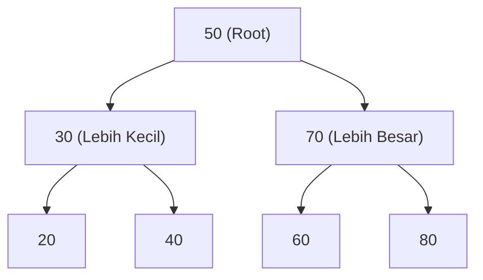

import Callout from '../../components/mdx/Callout.astro';
import MultiLangRunner from '../../components/mdx/MultiLangRunner.astro';

Berbeda dengan array dan linked list yang bersifat linier satu dimensi, **Tree (Pohon)** adalah struktur data hierarkis non-linier yang merefleksikan hubungan induk-anak (*Parent-Child Relationship*), seperti struktur direktori file di sistem operasi atau DOM HTML di peramban web.

---

## 1. Binary Search Tree (BST)

**Binary Search Tree (BST)** adalah pohon biner di mana setiap node memiliki maksimal 2 anak (*left child* & *right child*) dengan aturan ketat:
- Semua nilai di sub-pohon **kiri** harus **lebih kecil** (`<`) dari nilai node saat ini.
- Semua nilai di sub-pohon **kanan** harus **lebih besar** (`>`) dari nilai node saat ini.



Dengan aturan ini, pencarian elemen di BST berimbang memiliki kompleksitas waktu rata-rata `O(log N)`.

---

## 2. Tree Traversals: Menelusuri Seluruh Node Pohon

1. **Depth-First Search (DFS)**:
   - **In-Order (Kiri -> Induk -> Kanan)**: Menghasilkan data pohon terurut naik (*Ascending*).
   - **Pre-Order (Induk -> Kiri -> Kanan)**: Berguna untuk menyalin atau serialisasi struktur pohon.
   - **Post-Order (Kiri -> Kanan -> Induk)**: Berguna untuk menghapus pohon dari daun (*leaf*) ke akar.
2. **Breadth-First Search (BFS / Level-Order)**:
   - Menelusuri node baris per baris (*level by level*) dari atas ke bawah menggunakan antrean (**Queue**).

---

## 3. Struktur Data Trie (Prefix Tree) untuk Fitur Autocomplete

**Trie** (dibaca *"try"*) adalah pohon pencarian kata khusus di mana setiap node mewakili satu karakter huruf.

```text
        (Root)
       /      \
     'c'      'd'
     /          \
   'a'          'o'
   /  \           \
 'r'  't'         'g'
(car) (cat)      (dog)
```

### Mengapa Trie Sangat Cepat untuk Search Suggestions?
Pencarian prefix kata (misal mencari semua kata yang berawalan `"kot"`) hanya memakan waktu `O(L)` di mana `L` adalah panjang huruf prefix, **sama sekali tidak bergantung pada total jutaan kata yang tersimpan di kamus**!

---

## 4. Praktik Interaktif: Implementasi Trie Autocomplete Engine

Eksplorasi pembuatan Trie engine untuk fitur pencarian autocomplete kata kunci:

<MultiLangRunner
  language="javascript"
  title="Implementasi Trie Prefix Tree untuk Search Autocomplete"
  initialCode={`class TrieNode {
  constructor() {
    this.children = {};
    this.isEndOfWord = false;
  }
}

class Trie {
  constructor() {
    this.root = new TrieNode();
  }

  // Menyisipkan kata ke dalam Trie
  insert(word) {
    let current = this.root;
    const lowerWord = word.toLowerCase();

    for (let i = 0; i < lowerWord.length; i++) {
      const char = lowerWord[i];
      if (!current.children[char]) {
        current.children[char] = new TrieNode();
      }
      current = current.children[char];
    }
    current.isEndOfWord = true;
  }

  // Mencari semua kata yang diawali dengan prefix tertentu (Autocomplete)
  autocomplete(prefix) {
    let current = this.root;
    const lowerPrefix = prefix.toLowerCase();

    // 1. Telusuri node sampai ke akhir karakter prefix
    for (let i = 0; i < lowerPrefix.length; i++) {
      const char = lowerPrefix[i];
      if (!current.children[char]) {
        return []; // Prefix tidak ditemukan di kamus
      }
      current = current.children[char];
    }

    // 2. Kumpulkan semua kata turunan dari sub-pohon ini menggunakan DFS
    const results = [];
    this._collectWords(current, lowerPrefix, results);
    return results;
  }

  _collectWords(node, currentWord, results) {
    if (node.isEndOfWord) {
      results.push(currentWord);
    }

    for (const char in node.children) {
      this._collectWords(node.children[char], currentWord + char, results);
    }
  }
}

// --- PENGUJIAN AUTOCOMPLETE TRIE ---
const searchTrie = new Trie();

// Seeding kata kunci pencarian
const dictionary = [
  "javascript", "java", "json", "jwt", 
  "python", "pandas", "postgres", "prisma",
  "docker", "devops", "django"
];

dictionary.forEach(word => searchTrie.insert(word));

console.log("=== PENGUJIAN SEARCH SUGGESTIONS (TRIE) ===");
console.log("Ketik 'j' -> Saran Pencarian:", searchTrie.autocomplete("j"));
console.log("Ketik 'p' -> Saran Pencarian:", searchTrie.autocomplete("p"));
console.log("Ketik 'post' -> Saran Pencarian:", searchTrie.autocomplete("post"));
console.log("Ketik 'd' -> Saran Pencarian:", searchTrie.autocomplete("d"));`}
/>

<Callout type="tip" title="Pemanfaatan di Industri">
  Trie digunakan pada mesin *search engine search bar*, kamus *T9 predictive text* ponsel, *IP routing table (Longest Prefix Match)*, dan algoritma *Spell Checker*.
</Callout>
