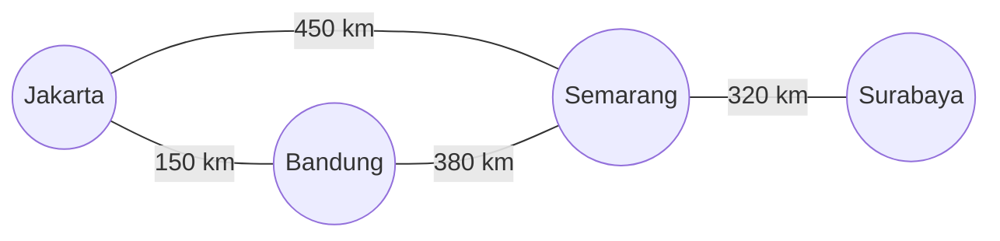

import Callout from '../../components/mdx/Callout.astro';
import MultiLangRunner from '../../components/mdx/MultiLangRunner.astro';

**Graf (Graph)** adalah struktur data paling fleksibel dan kuat yang merepresentasikan jaringan entitas (*Vertices / Nodes*) yang terhubung oleh relasi (*Edges*). Contoh nyata representasi graf:
- **Jaringan Sosial (Facebook/LinkedIn)**: Node = Pengguna, Edge = Pertemanan.
- **Peta Navigasi (Google Maps)**: Node = Persimpangan/Kota, Edge = Jalan Raya (dengan bobot jarak/waktu).
- **Infrastruktur Internet**: Node = Router/Server, Edge = Kabel Fiber Optik.

---

## 1. Representasi Graf: Adjacency List vs Adjacency Matrix



Di industri, kita lebih sering menggunakan **Adjacency List (Daftar Ketetanggaan)** berbasis Hash Map karena hemat memori `O(V + E)`:

```javascript
const roadGraph = {
  "Jakarta": [ { to: "Bandung", weight: 150 }, { to: "Semarang", weight: 450 } ],
  "Bandung": [ { to: "Jakarta", weight: 150 }, { to: "Semarang", weight: 380 } ],
  "Semarang": [ { to: "Jakarta", weight: 450 }, { to: "Bandung", weight: 380 }, { to: "Surabaya", weight: 320 } ],
  "Surabaya": [ { to: "Semarang", weight: 320 } ]
};
```

---

## 2. Graph Traversals: BFS vs DFS

1. **Breadth-First Search (BFS)**: Menjelajahi tetangga terdekat lapis demi lapis menggunakan **Queue**. Sangat ideal untuk menemukan *Shortest Path* (jalur terpendek dengan jumlah langkah paling sedikit) pada graf tanpa bobot.
2. **Depth-First Search (DFS)**: Menjelajahi satu jalur sedalam mungkin hingga ujung menggunakan **Stack / Rekursi**. Sangat ideal untuk mendeteksi siklus (*Cycle Detection*) dan penataan urutan dependensi (*Topological Sort*).

---

## 3. Algoritma Dijkstra (Shortest Path Finding)

Untuk graf dengan jarak/bobot (*Weighted Graph*), **Algoritma Dijkstra** menemukan rute dengan akumulasi biaya terkecil dari titik awal ke seluruh titik tujuan:

1. Inisialisasi jarak ke semua kota sebagai `Infinity` (tak terhingga), kecuali kota asal yang bernilai `0`.
2. Kunjungi kota yang belum diproses dengan jarak sementara terkecil (*Greedy Selection*).
3. Perbarui jarak ke semua tetangga yang terhubung (*Relaxation Step*).
4. Tandai kota tersebut sebagai selesai dan ulangi hingga kota tujuan tercapai.

---

## 4. Praktik Interaktif: Implementasi Algoritma Dijkstra Logistik

Jalankan live sandbox di bawah ini untuk menghitung rute tercepat pengiriman logistik antar kota:

<MultiLangRunner
  language="javascript"
  title="Implementasi Algoritma Dijkstra untuk Rute Logistik Antar Kota"
  initialCode={`class WeightedGraph {
  constructor() {
    this.adjacencyList = {};
  }

  addVertex(vertex) {
    if (!this.adjacencyList[vertex]) this.adjacencyList[vertex] = [];
  }

  addEdge(vertex1, vertex2, weight) {
    this.adjacencyList[vertex1].push({ node: vertex2, weight });
    this.adjacencyList[vertex2].push({ node: vertex1, weight }); // Graf Dua Arah
  }

  // Algoritma Dijkstra untuk Rute Terpendek
  findShortestPath(startNode, endNode) {
    const distances = {};
    const previous = {};
    const unvisited = new Set();

    // 1. Inisialisasi State Awal
    for (const vertex in this.adjacencyList) {
      if (vertex === startNode) {
        distances[vertex] = 0;
      } else {
        distances[vertex] = Infinity;
      }
      previous[vertex] = null;
      unvisited.add(vertex);
    }

    while (unvisited.size > 0) {
      // 2. Pilih node yang belum dikunjungi dengan jarak terkecil
      let closestNode = null;
      for (const node of unvisited) {
        if (closestNode === null || distances[node] < distances[closestNode]) {
          closestNode = node;
        }
      }

      // Jika jarak terkecil adalah Infinity, sisa node tidak terhubung
      if (distances[closestNode] === Infinity) break;

      // Jika kita telah mencapai node tujuan, rekonstruksi jalurnya
      if (closestNode === endNode) {
        const path = [];
        let current = endNode;
        while (current) {
          path.unshift(current);
          current = previous[current];
        }
        return { totalDistanceKm: distances[endNode], route: path };
      }

      unvisited.delete(closestNode);

      // 3. Periksa semua tetangga dari closestNode
      for (const neighbor of this.adjacencyList[closestNode]) {
        if (unvisited.has(neighbor.node)) {
          const candidateDistance = distances[closestNode] + neighbor.weight;
          if (candidateDistance < distances[neighbor.node]) {
            distances[neighbor.node] = candidateDistance;
            previous[neighbor.node] = closestNode;
          }
        }
      }
    }

    return { totalDistanceKm: Infinity, route: [] };
  }
}

// Inisialisasi Peta Jaringan Jalan
const map = new WeightedGraph();
["Jakarta", "Bandung", "Cirebon", "Semarang", "Yogyakarta", "Surabaya"].forEach(city => map.addVertex(city));

map.addEdge("Jakarta", "Bandung", 150);
map.addEdge("Jakarta", "Cirebon", 220);
map.addEdge("Bandung", "Yogyakarta", 400);
map.addEdge("Cirebon", "Semarang", 230);
map.addEdge("Semarang", "Surabaya", 350);
map.addEdge("Yogyakarta", "Surabaya", 325);
map.addEdge("Semarang", "Yogyakarta", 120);

console.log("=== PENGUJIAN RUTE TERPENDEK LOGISTIK (DIJKSTRA) ===");
const result = map.findShortestPath("Jakarta", "Surabaya");
console.log(\`Rute Tercepat: \${result.route.join(" ──> ")}\`);
console.log(\`Total Jarak: \${result.totalDistanceKm} km\`);`}
/>

<Callout type="tip" title="Optimasi dengan Priority Queue">
  Pada graf besar dengan jutaan node, gunakan **Min-Heap (Priority Queue)** untuk memilih node dengan jarak minimum dalam `O(log V)`, sehingga kompleksitas Dijkstra menjadi `O((V + E) log V)`.
</Callout>
